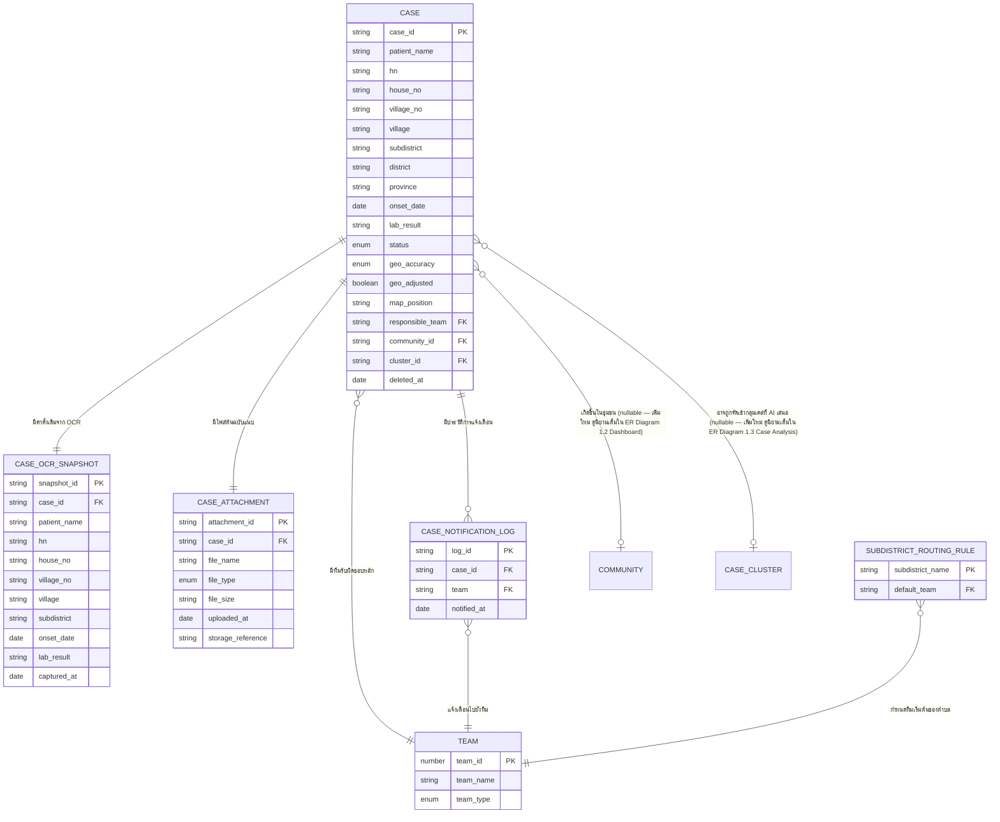
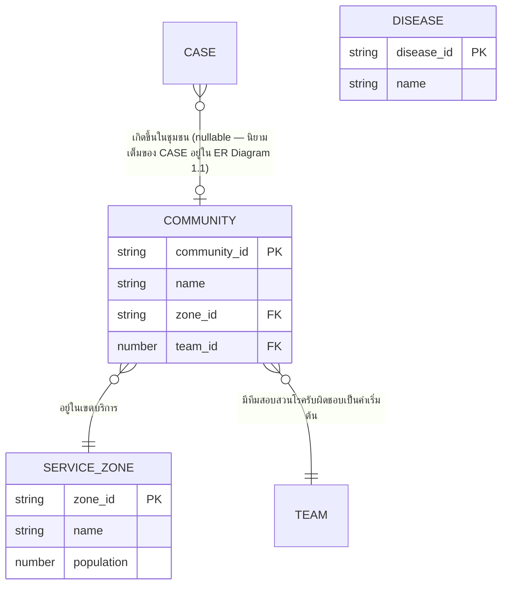
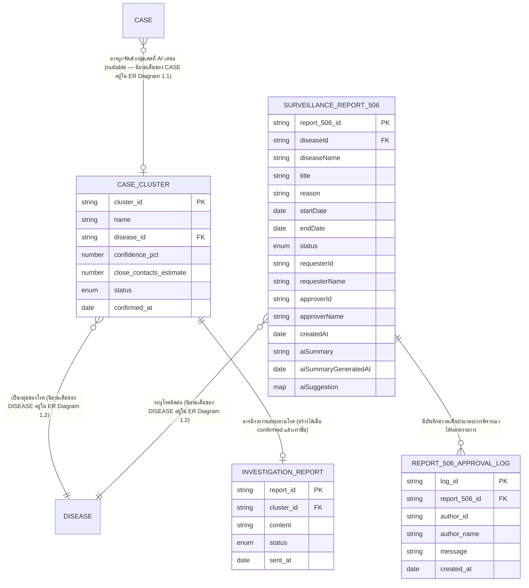
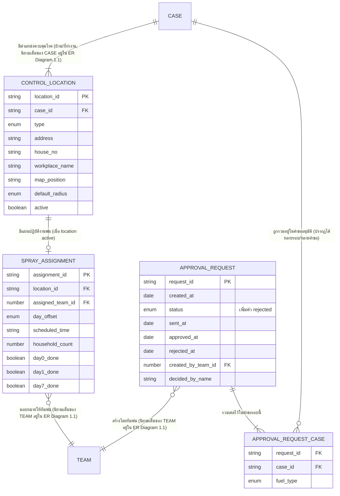
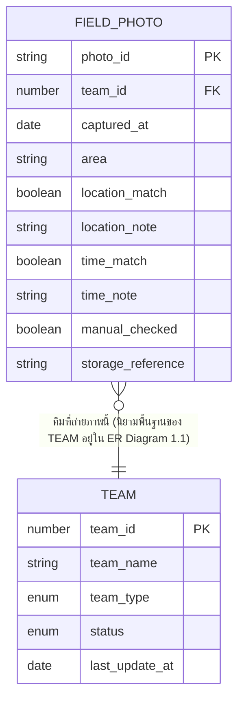
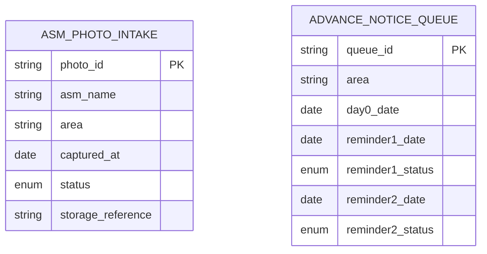
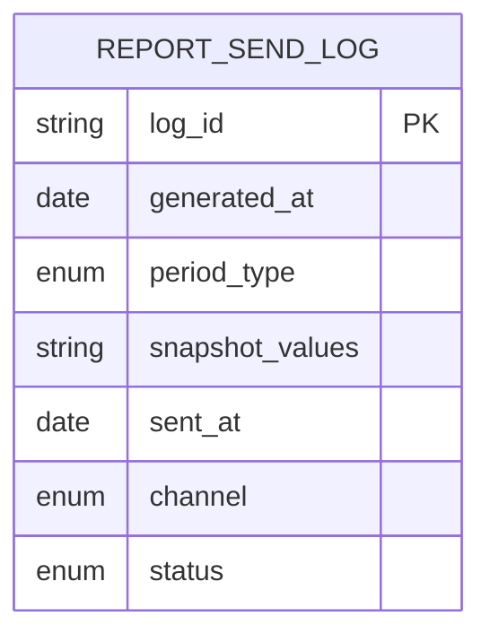
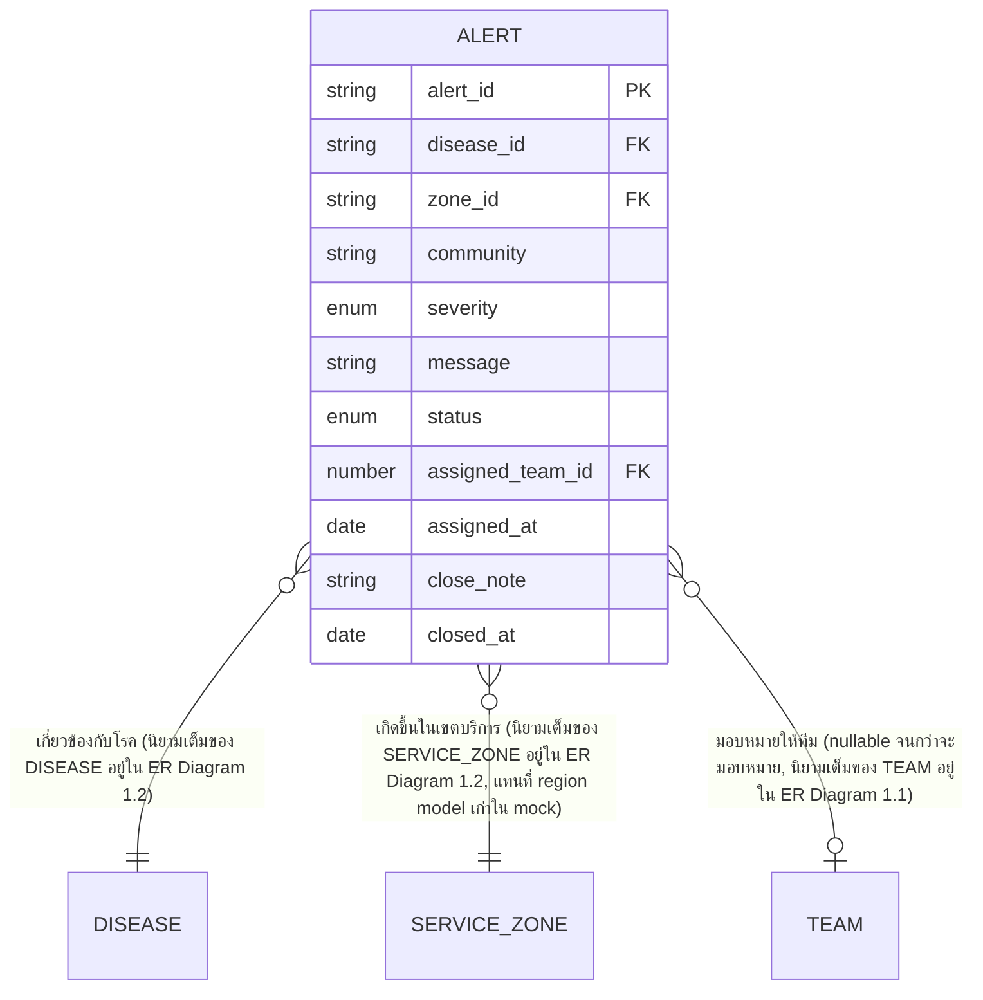

# Data Model — AI-DSRP (ทั้งระบบ 8 โมดูล)

เอกสารนี้เป็น**conceptual data model เท่านั้น** — ยังไม่ผูกกับ database engine, ภาษาโปรแกรม หรือ framework ใดๆ (ยังไม่มีการยืนยันเทคโนโลยีมาในรอบนี้) ตามโครงจาก skill `data-contract-builder` (`references/data-contract-templates.md`)

ขอบเขต: ครอบคลุมทั้ง 8 โมดูลของระบบตาม [[../../01-requirements/01-spec/FEATURE-LIST|FEATURE-LIST.md]] — **Case Intake** (`FEAT-INTAKE-*`, เขียนไว้ก่อนหน้ารอบนี้ ไม่แก้เนื้อหาเดิม ยกเว้น 2 จุดที่ระบุไว้ชัดเจน: เพิ่ม `community_id`/`cluster_id` ใน `CASE` และเปลี่ยน `INVESTIGATION_TEAM` เป็น `TEAM` + `team_type`), **Dashboard** (`FEAT-DASH-*`), **Case Analysis** (`FEAT-ANALYSIS-*`), **Control Plan** (`FEAT-CONTROL-*`), **Field Tracking** (`FEAT-TRACK-*`), **ASM Coordination** (`FEAT-ASM-*`), **Reports** (`FEAT-REPORT-*`), **Alerts** (`FEAT-ALERT-*`) — อ้างอิง mock data จริงใน `prototypes/v1/*.js` ของแต่ละโมดูลเป็นฐาน — feature ที่ยังเป็น backlog ออกแบบ schema ให้พอ "รองรับได้" แต่ไม่ลงรายละเอียดการเชื่อมต่อ 3rd-party API จริง

## 1. ER Diagram

### 1.1 Case Intake (`FEAT-INTAKE-*`)

> เพิ่มเข้ามาในรอบนี้ (ดูหมายเหตุด้านล่างไดอะแกรม): field `community_id`/`cluster_id` ใน `CASE`, และเปลี่ยนชื่อ `INVESTIGATION_TEAM` เป็น `TEAM` (เพิ่ม `team_type`) — ไม่มีการแก้ไขอื่นใดต่อเนื้อหา Case Intake เดิม

**หมายเหตุ cardinality ที่ยืนยันแล้วกับผู้ใช้ (Ambiguity Protocol):**

- `CASE` ↔ `CASE_ATTACHMENT` = **1:1** — 1 เคสมีไฟล์ต้นฉบับแนบได้ 1 ไฟล์เท่านั้นในรอบนี้ ตรงกับ mock ปัจจุบันที่มี field ไฟล์ฝังอยู่ระดับเคสเดียว (ไม่ใช่ list)
- `CASE` ↔ `CASE_OCR_SNAPSHOT` = **1:1** — capture ค่า OCR ดั้งเดิมครั้งเดียวตอน OCR เสร็จ, immutable, ใช้ diff กับค่าปัจจุบันใน `CASE`
- `CASE` ↔ `TEAM` (ผ่าน `responsible_team`) = **N:1** — 1 เคสมีทีมรับผิดชอบหลักทีมเดียว ณ เวลาใดเวลาหนึ่ง (ไม่ผูกหลายทีมพร้อมกัน) — entity นี้เปลี่ยนชื่อจาก `INVESTIGATION_TEAM` เป็น `TEAM` ในรอบนี้ (ยืนยันแล้ว) เพื่อรวมทีมสอบสวนโรค (5 ทีมเดิม) กับทีมพ่น (4 ทีมใหม่) ไว้ที่ entity เดียวกัน แยกด้วย `team_type`
- `CASE` ↔ `CASE_NOTIFICATION_LOG` = **1:N** — แยก concept "ประวัติการแจ้งเตือน" ออกจาก "ทีมรับผิดชอบปัจจุบัน" เพื่อรองรับกรณีแจ้งเตือนซ้ำในอนาคต (ปัจจุบัน prototype ยืนยันได้ครั้งเดียวต่อเคส จึงมี log ไม่เกิน 1 รายการต่อเคสในทางปฏิบัติ แต่ schema ไม่ได้ล็อกไว้แค่ 1 รายการ)
- `CASE` ↔ `COMMUNITY` = **N:1 (optional/nullable)** — เพิ่มใหม่ในรอบนี้ (ยืนยันแล้ว) คู่กับ field string เดิม (subdistrict/district/village/house_no) ไม่ลบของเดิม เพื่อให้ Dashboard join ได้จริงแทนการพึ่ง string match — nullable เพราะยังมีเคสเก่าที่ยังไม่ได้ผูก community
- `CASE` ↔ `CASE_CLUSTER` = **N:1 (optional/nullable)** — เพิ่มใหม่ในรอบนี้ (ยืนยันแล้ว) — nullable เพราะไม่ใช่ทุกเคสจะถูก AI จัดกลุ่ม

### 1.2 Dashboard (`FEAT-DASH-*`)

> Dashboard ไม่มี entity ของตัวเองที่เป็น CRUD — เป็น read-only/aggregation จาก `CASE`/`ALERT`/`TEAM` ที่มีอยู่แล้ว entity ใหม่ในโมดูลนี้เป็น**ข้อมูลอ้างอิง (lookup)** ล้วนๆ: `DISEASE`, `SERVICE_ZONE`, `COMMUNITY`

**หมายเหตุ**: `DISEASE`/`SERVICE_ZONE`/`COMMUNITY` เป็น master data ที่ทุกโมดูลอ้างอิงร่วมกัน (`ALERT`, `CASE_CLUSTER` อ้าง `DISEASE`; `ALERT` อ้าง `SERVICE_ZONE`; `CASE`/`COMMUNITY` อ้าง `SERVICE_ZONE`/`TEAM`) — ตัวเลือก "ทุกโรค" ในตัวกรอง UI เป็นค่าระดับ UI เท่านั้น ไม่ใช่แถวข้อมูลจริงใน `DISEASE`

### 1.3 Case Analysis (`FEAT-ANALYSIS-*`)

**หมายเหตุ cardinality ที่ยืนยันแล้ว**: `CASE_CLUSTER` ↔ `INVESTIGATION_REPORT` = **1:1 (optional)** — 1 กลุ่มเคสมีรายงานได้อย่างมาก 1 ฉบับ และสร้างได้เฉพาะกลุ่มที่ `status = confirmed` เท่านั้น (business rule) — chatbot ประสานงาน อสม. (`FEAT-ANALYSIS-03`) เป็น scripted demo แบบ fixed script ในรอบนี้ ไม่มี entity ข้อมูลของตัวเอง (ยังไม่ persist บทสนทนา) จนกว่า `FEAT-ANALYSIS-06` (chatbot จริง) จะถูกทำ — `SURVEILLANCE_REPORT_506` ↔ `REPORT_506_APPROVAL_LOG` = **1:N (ไม่มี limit)** — 1 รง.506 มีบันทึกความเห็นประกอบการพิจารณาได้หลายรายการตามลำดับเวลา — `requesterId`/`requesterName`/`approverId`/`approverName` (ของ `SURVEILLANCE_REPORT_506`) และ `author_id`/`author_name` (ของ `REPORT_506_APPROVAL_LOG`) เป็น free-text/id snapshot ชั่วคราวเพราะระบบยังไม่มี USER entity — gap เดียวกับที่ flag ไว้ใน `APPROVAL_REQUEST.decided_by_name` ด้านล่าง — **บันทึก (2026-09-06)**: รง.506 ไม่ได้ผูกกับ `CASE` โดยตรงอีกต่อไป (field `case_id` ถูกตัดออกในรอบ sync ให้ตรงกับข้อมูลจริงที่ seed แล้ว)

### 1.4 Control Plan (`FEAT-CONTROL-*`)

**หมายเหตุ cardinality ที่ยืนยันแล้ว**:
- `CASE` ↔ `CONTROL_LOCATION` = **1:N (1 หรือ 2 ตำแหน่งต่อเคส — บ้าน/ที่ทำงาน)** — ต้องมี `active = true` อย่างน้อย 1 ตำแหน่งเสมอ (business rule)
- `CONTROL_LOCATION` ↔ `SPRAY_ASSIGNMENT` = **1:1 (optional)** — สร้างแผนปฏิบัติงานเมื่อตำแหน่งนั้น active เท่านั้น
- `APPROVAL_REQUEST` ↔ `CASE` = **N:M ผ่าน junction `APPROVAL_REQUEST_CASE`** — **1 คำขอต่อ 1 รอบ (batch ของเคส active ขณะนั้น) เก็บเป็น log ประวัติ** (ยืนยันแล้ว ไม่ใช่ single global draft แบบที่ mock ปัจจุบันทำ) — เคสเดียวกันปรากฏในหลายคำขอ (หลายรอบ) ได้ตามกาลเวลา
- `APPROVAL_REQUEST` ↔ `TEAM` = **N:1** — 1 ทีมสร้างได้หลายคำขอ, 1 คำขอมีทีมผู้สร้างทีมเดียว

### 1.5 Field Tracking (`FEAT-TRACK-*`)

**หมายเหตุ**: `status`/`last_update_at` ใน `TEAM` ใช้เฉพาะทีมประเภท `control` (ทีมพ่น) — ทีมประเภท `investigation` ไม่มีค่าใน 2 field นี้ในรอบนี้ (nullable) เก็บแค่**สถานะปัจจุบัน** ไม่เก็บประวัติการเคลื่อนที่ (ยืนยันแล้ว) — โซนที่วางแผนไว้ (depot/zoneCenter/รัศมี) สำหรับวาดแผนที่ติดตามเป็นค่าที่**คำนวณ/join จาก `CONTROL_LOCATION` + `SPRAY_ASSIGNMENT`** ของทีมนั้นในวันนั้น ไม่ persist ซ้ำเป็น field แยกใน `TEAM` (ดู assumption ท้ายผลลัพธ์)

### 1.6 ASM Coordination (`FEAT-ASM-*`)

**หมายเหตุ**: ทั้ง 2 entity เป็น standalone ในรอบนี้ — `area` เป็น string อธิบายพื้นที่ ยังไม่ผูกเป็น `reference → COMMUNITY`/`CONTROL_LOCATION` ตามที่ยืนยันในแผน (ไม่ normalize เพิ่ม, เก็บแบบ embedded 2 reminder ต่อแถวตาม mock)

### 1.7 Reports (`FEAT-REPORT-*`)

**หมายเหตุ**: KPI ที่แสดงในหน้า Reports (จำนวนเคส, HI/CI, % พ่นแล้ว, % QC ผ่าน) เป็นค่า**คำนวณสด**จาก `CASE`/`SPRAY_ASSIGNMENT`/`FIELD_PHOTO` ฯลฯ ไม่ persist เป็น entity แยก (ยืนยันแล้ว) — `REPORT_SEND_LOG` เก็บเฉพาะ snapshot ค่าที่คำนวณได้ ณ ตอนส่ง เป็น audit log ว่าส่งอะไรไปเมื่อไหร่

### 1.8 Alerts (`FEAT-ALERT-*`)

**หมายเหตุ**: mock ปัจจุบันใน `alerts.js` ใช้ `regionId` แบบ 6-ภาคทั่วประเทศ (north/central/...) ซึ่งไม่ตรงกับโครงสร้างเทศบาลเดียว/4 เขตบริการจริงของระบบ — schema นี้ใช้ `zone_id → SERVICE_ZONE` แทนตามที่ยืนยันแล้ว ถือเป็น gap ระหว่าง mock เดิมกับ data model จริงที่ flag ไว้ท้ายผลลัพธ์ — `community` เป็น string เสริม (nullable) ยังไม่ผูกเป็น `reference → COMMUNITY` ในรอบนี้ (ไม่ได้ระบุไว้ชัดว่าต้องเป็น FK ในแผนที่ยืนยัน)

## 2. Entity Dictionary

> **Native Type (Firestore)** เพิ่มเข้ามาในรอบนี้ตาม Tech Stack Integration ที่ `TECH-STACK.md` ยืนยัน Database engine เป็น **Firebase Firestore** แล้ว — กฎ mapping ที่ใช้เหมือนกันทุก entity: `string`→`string`, `number`→`number`, `boolean`→`boolean`, `date`→`Timestamp`, `enum(...)`→`string` (Firestore ไม่มี enum จริง ค่าที่อนุญาตต้อง validate ที่ Security Rules/backend), `reference → X`→`string` (เก็บเป็น **document ID** ของ collection ปลายทาง ไม่ใช่ Firestore `DocumentReference` type — ตรงกับที่ seed script จริงใน `scripts/seed/seed-data.js` ทำไปแล้ว เช่น `requesterId: "SRRT1"`) ชื่อ collection ต่อ entity ระบุกำกับด้วยบรรทัด **Collection** ก่อนตารางของแต่ละ entity — entity/attribute ที่ยังไม่แน่ใจ native type ระบุ flag ไว้แทนการเดา (ดู `TEAM.team_id` และ `DISEASE` ด้านล่าง)

### `CASE` — เคสผู้ป่วยที่รายงานเข้าระบบ (ข้อมูลปัจจุบัน/effective)

รองรับ Feature: `FEAT-INTAKE-01`, `FEAT-INTAKE-02`, `FEAT-INTAKE-03`, `FEAT-INTAKE-04`, `FEAT-INTAKE-07` (backlog — geo field), `FEAT-INTAKE-09` (backlog — unlock, ยังไม่รองรับในรอบนี้), `FEAT-DASH-*` (ผ่าน `community_id` — เพิ่มใหม่), `FEAT-ANALYSIS-01` (ผ่าน `cluster_id` — เพิ่มใหม่), `FEAT-CONTROL-01`/`02` (ผ่าน `CONTROL_LOCATION.case_id`)

**Collection**: `cases`

| Attribute | Conceptual Type | Native Type (Firestore) | จำเป็นต้องมี | คำอธิบาย |
|---|---|---|---|---|
| case_id | string (PK) | `string` | ใช่ | รหัสอ้างอิงเคสหลัก ไม่ซ้ำกันในระบบ |
| patient_name | string | `string` | ใช่ | ชื่อ-สกุลผู้ป่วย — แก้ไขได้ก่อนยืนยัน |
| hn | string | `string` | ใช่ | Hospital Number — แก้ไขได้ก่อนยืนยัน |
| house_no | string | `string` | ใช่ | บ้านเลขที่ — แก้ไขได้ก่อนยืนยัน |
| village_no | string | `string` | ใช่ | หมู่ที่ — แก้ไขได้ก่อนยืนยัน |
| village | string | `string` | ใช่ | ชื่อหมู่บ้าน — แก้ไขได้ก่อนยืนยัน |
| subdistrict | string | `string` | ใช่ | ตำบล — แก้ไขได้ก่อนยืนยัน, การแก้ไขค่านี้ trigger auto-route `responsible_team` (ดู `SUBDISTRICT_ROUTING_RULE`) |
| district | string | `string` | ใช่ | อำเภอ — **ไม่อยู่ในรายการฟิลด์ที่แก้ไขได้ผ่าน OCR Review ในรอบนี้** (ตรงกับ `saveEdit()` ของ prototype ปัจจุบันที่ไม่รวม `district`) |
| province | string | `string` | ใช่ | จังหวัด — เช่นเดียวกับ `district`, ไม่อยู่ในรายการฟิลด์ที่แก้ไขได้รอบนี้ |
| onset_date | date | `Timestamp` | ใช่ | วันที่เริ่มป่วยตามที่รายงาน — แก้ไขได้ก่อนยืนยัน |
| lab_result | string | `string` | ใช่ | ผลตรวจทางห้องปฏิบัติการ/คลินิก — แก้ไขได้ก่อนยืนยัน |
| status | enum(รอตรวจสอบ, ยืนยันแล้ว) | `string` | ใช่ | สถานะ human-in-the-loop — เปลี่ยนได้ทางเดียวจาก "รอตรวจสอบ" → "ยืนยันแล้ว" เท่านั้นในรอบนี้ (ไม่มี state สำหรับ unlock แก้ไขซ้ำ ตาม `FEAT-INTAKE-09` ที่ยังเป็น backlog) |
| geo_accuracy | enum(high, low) | `string` | ใช่ | ระดับความแม่นยำของพิกัดที่ได้มา (mock ปัจจุบันสุ่มค่า, ของจริงจะมาจาก Geocoding API ตาม `FEAT-INTAKE-07`) |
| geo_adjusted | boolean | `boolean` | ใช่ | ปรับพิกัดด้วยมือแล้วหรือยัง — มีผลเฉพาะกรณี `geo_accuracy = low` เป็น fallback ตามที่ ROADMAP.md ระบุ |
| map_position | string (conceptual) | `string` | ใช่ | ตำแหน่งสำหรับวาดหมุดบน Spot Map — เป็นค่าจำลองสำหรับ layout ในรอบนี้ ไม่ใช่พิกัดภูมิศาสตร์จริง (lat/long) จนกว่า `FEAT-INTAKE-07` จะเชื่อมต่อจริง |
| responsible_team | reference → `TEAM` | `string` (document ID → collection `teams`) | ใช่ | ทีมสอบสวนโรคที่รับผิดชอบเคสนี้ ณ ปัจจุบัน — auto-reassign ได้ตอนแก้ `subdistrict` (entity เปลี่ยนชื่อจาก `INVESTIGATION_TEAM` เป็น `TEAM` ในรอบนี้ — ดู Entity Dictionary ของ `TEAM` ด้านล่าง) |
| community_id | reference → `COMMUNITY` (nullable) | `string` (document ID → collection `communities`, nullable) | ไม่บังคับ (null = ยังไม่ได้ผูกชุมชน) | **เพิ่มใหม่ในรอบนี้** — ชุมชนที่เคสนี้เกิดขึ้น คู่กับ field string เดิม (subdistrict/district/village/house_no) เพื่อให้ Dashboard (`FEAT-DASH-*`) join ได้จริงแทนพึ่ง string match — ไม่ลบ field string เดิม |
| cluster_id | reference → `CASE_CLUSTER` (nullable) | `string` (document ID → collection `caseClusters`, nullable) | ไม่บังคับ (null = ยังไม่ถูกจัดกลุ่ม) | **เพิ่มใหม่ในรอบนี้** — กลุ่มเคสที่ AI เสนอและอาจยืนยันแล้ว (`FEAT-ANALYSIS-01`) — เคสหนึ่งอยู่ในกลุ่มได้อย่างมาก 1 กลุ่ม ณ เวลาหนึ่ง |
| deleted_at | date (nullable) | `Timestamp` (nullable) | ไม่บังคับ (null = ยังไม่ถูกลบ) | soft delete marker — ดูหัวข้อ Cross-cutting concerns |

**Business rule เพิ่มเติม**: แก้ไขข้อมูลได้เฉพาะเคสที่ `status = รอตรวจสอบ` เท่านั้น (ตรงกับ `startEdit()` ใน prototype ที่ปฏิเสธแถวที่ `confirmed`) — เคสที่ยืนยันแล้วต้องรอ `FEAT-INTAKE-09` (unlock flow, ยังไม่ทำ) ก่อนจะแก้ไขซ้ำได้

### `CASE_OCR_SNAPSHOT` — ค่าที่ OCR ดึงได้ตอนแรก (immutable audit baseline)

รองรับ Feature: `FEAT-INTAKE-02` (ฐานสำหรับ diff ตอน human-in-the-loop), `FEAT-INTAKE-05` (backlog — วัดความแม่นยำ OCR จริงในอนาคต)

**Collection**: `caseOcrSnapshots`

| Attribute | Conceptual Type | Native Type (Firestore) | จำเป็นต้องมี | คำอธิบาย |
|---|---|---|---|---|
| snapshot_id | string (PK) | `string` | ใช่ | รหัสอ้างอิง snapshot |
| case_id | reference → `CASE` (unique) | `string` (document ID → collection `cases`) | ใช่ | เคสที่ snapshot นี้เป็นของ — 1:1 กับ CASE |
| patient_name | string | `string` | ใช่ | ค่าดั้งเดิมจาก OCR (ก่อนแก้ไขใดๆ) |
| hn | string | `string` | ใช่ | ค่าดั้งเดิมจาก OCR |
| house_no | string | `string` | ใช่ | ค่าดั้งเดิมจาก OCR |
| village_no | string | `string` | ใช่ | ค่าดั้งเดิมจาก OCR |
| village | string | `string` | ใช่ | ค่าดั้งเดิมจาก OCR |
| subdistrict | string | `string` | ใช่ | ค่าดั้งเดิมจาก OCR |
| onset_date | date | `Timestamp` | ใช่ | ค่าดั้งเดิมจาก OCR |
| lab_result | string | `string` | ใช่ | ค่าดั้งเดิมจาก OCR |
| captured_at | date | `Timestamp` | ใช่ | เวลาที่ OCR extraction เสร็จ (ครั้งเดียว, immutable) |

**หมายเหตุ**: mirror เฉพาะ field ที่แก้ไขได้ใน `CASE` เท่านั้น (ไม่รวม `district`/`province` เพราะไม่อยู่ในรายการฟิลด์ที่แก้ไขได้ — จึงไม่จำเป็นต้องเก็บค่าดั้งเดิมไว้ diff) — เป็น audit trail แบบ "ต้นฉบับคู่กับค่าที่แก้แล้ว" ตามที่ยืนยันในแผน ไม่ใช่ full version history ทุกครั้งที่แก้

### `CASE_ATTACHMENT` — ไฟล์ต้นฉบับที่แนบมากับเคส

รองรับ Feature: `FEAT-INTAKE-01`, `FEAT-INTAKE-06` (backlog — เก็บจริงใน Google Drive)

**Collection**: `caseAttachments`

| Attribute | Conceptual Type | Native Type (Firestore) | จำเป็นต้องมี | คำอธิบาย |
|---|---|---|---|---|
| attachment_id | string (PK) | `string` | ใช่ | รหัสอ้างอิงไฟล์แนบ |
| case_id | reference → `CASE` (unique) | `string` (document ID → collection `cases`) | ใช่ | เคสที่ไฟล์นี้เป็นของ — 1:1 กับ CASE ในรอบนี้ |
| file_name | string | `string` | ใช่ | ชื่อไฟล์ต้นฉบับ |
| file_type | enum(PDF, JPEG) | `string` | ใช่ | ประเภทไฟล์ที่อัปโหลด |
| file_size | string | `string` | ใช่ | ขนาดไฟล์แบบแสดงผล (เช่น "842 KB") |
| uploaded_at | date | `Timestamp` | ใช่ | เวลาที่อัปโหลด |
| storage_reference | string (conceptual) | `string` | ใช่ | ที่อยู่อ้างอิงของไฟล์ในระบบจัดเก็บ — รอบนี้เป็น concept กลางๆ เท่านั้น ไม่ได้ออกแบบผูกกับ Google Drive API จริงตาม `FEAT-INTAKE-06` |

### `TEAM` — ทีมสอบสวนโรค/ทีมพ่น ตามเขตพื้นที่ (lookup)

รองรับ Feature: `FEAT-INTAKE-03`, `FEAT-TRACK-01`, `FEAT-CONTROL-01`, `FEAT-ALERT-01` (**entity นี้เปลี่ยนชื่อจาก `INVESTIGATION_TEAM` ในรอบนี้ — ยืนยันแล้ว** เพื่อรวมทีมสอบสวนโรค 5 ทีมเดิมกับทีมพ่น 4 ทีมใหม่ไว้ที่ entity เดียวกัน แยกด้วย `team_type`)

**Collection**: `teams`

| Attribute | Conceptual Type | Native Type (Firestore) | จำเป็นต้องมี | คำอธิบาย |
|---|---|---|---|---|
| team_id | number (PK) | `string` (ใช้เป็น Firestore document ID ตรงๆ เช่น `"1"`-`"9"` — ดูหมายเหตุด้านล่าง) | ใช่ | รหัสทีม — 5 รายการทีมสอบสวนโรค (`team_type = investigation`) + 4 รายการทีมพ่น (`team_type = control`) ตาม mock |
| team_name | string | `string` | ใช่ | ชื่อทีม เช่น "ทีมสอบสวนโรค เขต 1", "ทีมพ่น 1" |
| team_type | enum(investigation, control) | `string` | ใช่ | **เพิ่มใหม่ในรอบนี้** — ประเภททีม แยกทีมสอบสวนโรคออกจากทีมพ่น |
| status | enum(not_arrived, spraying, done) (nullable) | `string` (nullable) | ไม่บังคับ (ใช้เฉพาะ `team_type = control`) | **เพิ่มใหม่ในรอบนี้** (`FEAT-TRACK-01`) — สถานะปฏิบัติงานภาคสนามปัจจุบันของทีมพ่น เก็บแค่สถานะปัจจุบัน ไม่เก็บประวัติ (ยืนยันแล้ว) |
| last_update_at | date (nullable) | `Timestamp` (nullable) | ไม่บังคับ (ใช้เฉพาะ `team_type = control`) | **เพิ่มใหม่ในรอบนี้** (`FEAT-TRACK-01`) — เวลาที่อัปเดตสถานะล่าสุด |

**หมายเหตุ native type ของ `team_id`**: ใช้ `team_id` เป็น Firestore document ID ตรงๆ (แปลงเป็น string เช่น `"1"`-`"9"`) — ตรงกับ convention เดียวกับ `users` (`CUCU1`/`SRRT1`/`SRRT3`) และ `506Types` (`66`/`67`/`68`) ที่ seed จริงไปแล้ว คือใช้ ID ทางธุรกิจเป็น document ID โดยตรง ไม่ใช้ auto-generated ID แยกต่างหาก — resolve แล้ว ไม่ใช่ open question อีกต่อไป (เดิม conceptual type ระบุเป็น `number` แต่ Firestore document ID เก็บเป็น string เสมอไม่ว่ากรณีใด จึงไม่ขัดกับแนวทางนี้)

### `SUBDISTRICT_ROUTING_RULE` — กฎ auto-route ตำบล → ทีมเริ่มต้น (lookup)

รองรับ Feature: `FEAT-INTAKE-02` (ใช้ตอนแก้ไขและบันทึก), `FEAT-INTAKE-03`

**Collection**: `subdistrictRoutingRules`

| Attribute | Conceptual Type | Native Type (Firestore) | จำเป็นต้องมี | คำอธิบาย |
|---|---|---|---|---|
| subdistrict_name | string (PK) | `string` | ใช่ | ชื่อตำบลที่ระบบรู้จักล่วงหน้า (mock ปัจจุบันมี 6 รายการ) |
| default_team | reference → `TEAM` | `string` (document ID → collection `teams`) | ใช่ | ทีมที่ควรรับผิดชอบตำบลนี้เป็นค่าเริ่มต้น (`team_type = investigation` เสมอในบริบทนี้) |

**Business rule สำคัญ**: กฎนี้ครอบคลุมเฉพาะตำบลที่มีอยู่ใน rule set เท่านั้น — ถ้าผู้ใช้แก้ไข `subdistrict` ของเคสเป็นชื่อตำบลที่**ไม่ตรง**กับ `subdistrict_name` ใดใน entity นี้ ระบบจะ**ไม่เปลี่ยน** `responsible_team` เดิมของเคสนั้น (คงค่าก่อนแก้ไขไว้) — ตรงกับ behavior ของ `SUBDISTRICT_TEAM_MAP` ใน `prototypes/v1/case-intake.js` ทุกประการ

### `CASE_NOTIFICATION_LOG` — ประวัติการแจ้งเตือนทีมสอบสวนโรค

รองรับ Feature: `FEAT-INTAKE-03`, `FEAT-INTAKE-08` (backlog — ช่องทางแจ้งเตือนจริงผ่าน LINE OA)

**Collection**: `caseNotificationLogs`

| Attribute | Conceptual Type | Native Type (Firestore) | จำเป็นต้องมี | คำอธิบาย |
|---|---|---|---|---|
| log_id | string (PK) | `string` | ใช่ | รหัสอ้างอิง log entry |
| case_id | reference → `CASE` | `string` (document ID → collection `cases`) | ใช่ | เคสที่ถูกแจ้งเตือน |
| team | reference → `TEAM` | `string` (document ID → collection `teams`) | ใช่ | ทีมที่ได้รับแจ้งเตือน ณ เวลานั้น |
| notified_at | date | `Timestamp` | ใช่ | เวลาที่ส่งแจ้งเตือน |

**หมายเหตุ**: entity นี้เก็บเฉพาะ reference ไปยัง `CASE`/`TEAM` + เวลา ไม่ denormalize ชื่อผู้ป่วย/ตำบลไว้ในตัวเอง (ต่างจาก mock `NOTIFICATIONS[]` ที่เก็บ `patientName`/`subdistrict` แบบ snapshot ไว้ตรงๆ เพื่อความสะดวกในการ render) — ข้อมูลแสดงผลเหล่านั้นต้องดึงผ่าน `case_id` ตอน query แทน ดู "Assumption" ท้ายผลลัพธ์

### `USER` — ผู้ใช้งานปัจจุบันของระบบ

รองรับ Feature: `FEAT-PLATFORM-02` (Firebase Authentication, Email/Password — ยืนยันแล้วใน `TECH-STACK.md`, implement จริงแล้วใน prototype: `login.html`/`auth-guard.js`)

**สถานะการเชื่อม Auth (2026-09-07)**: มี Firebase Auth account จริง 3 บัญชี (ผูก email เดียวกับ 3 แถวใน collection นี้) — วิธีจับคู่ที่ implement จริงคือ **query `users` ด้วย `where("email", "==", auth.currentUser.email")` หลัง login สำเร็จ** (ดู `auth-guard.js`/`case-analysis-506.js`) **ไม่ได้เก็บ Firebase Auth UID เป็น field ในเอกสารนี้เลย** — เป็นทางเลือกที่ใช้งานได้จริงในระดับ prototype แต่มีข้อจำกัด: อีเมลซ้ำ/เปลี่ยนอีเมลจะทำให้จับคู่ผิดพลาด, ต้อง query ทุกครั้งแทนที่จะ lookup ตรงด้วย UID — ยังไม่ใช่ role-based authorization เต็มรูปแบบ (ทุกผู้ใช้ที่ login เห็นทุกหน้า/ทุกฟังก์ชันเหมือนกัน ไม่มีการจำกัดสิทธิ์ตาม `role` จริง) **ปรับปรุง (2026-09-21)**: ยืนยันแนวทางแก้ข้อจำกัดนี้แล้ว — เพิ่ม field `authUid` เก็บ Firebase Auth UID ของแต่ละผู้ใช้ (ดู Entity Dictionary ด้านล่าง) เพื่อใช้แทนการจับคู่ด้วย email ในอนาคต ยังไม่ใช่การเปลี่ยน document ID เดิม (คง business ID เช่น `SRRT1` ไว้เป็น document ID) — การ implement จริง (backfill ข้อมูล 3 ผู้ใช้เดิม + แก้ query logic ใน `auth-guard.js`) เป็นงานแยกที่ยังไม่ทำในรอบนี้

**Collection**: `users`

| Attribute | Conceptual Type | Native Type (Firestore) | จำเป็นต้องมี | คำอธิบาย |
|---|---|---|---|---|
| user_id | string (PK) | `string` | ใช่ | รหัสผู้ใช้ (เช่น `CUCU1`, `SRRT1`, `SRRT3` ตาม seed จริง) |
| name | string | `string` | ใช่ | ชื่อ-สกุลผู้ใช้ |
| email | string | `string` | ใช่ | อีเมลผู้ใช้ (seed ปัจจุบันใช้ค่าชั่วคราวรูปแบบ `{id}@ai-dsrp.local` สำหรับบางราย — ดู comment ใน `seed-data.js`) |
| role | enum | `string` | ใช่ | บทบาทผู้ใช้ (ค่าที่ seed แล้ว: `manager`, `team1`, `team3` — ยังไม่มีชุดค่า role ที่เป็นทางการ/ผูก permission จริง) |
| authUid | string (nullable) | `string` (nullable) | ไม่บังคับ (null จนกว่าจะ backfill/ผูกกับบัญชี Firebase Auth จริง) | Firebase Auth UID ของผู้ใช้คนนี้ — **เพิ่มใหม่ (ยืนยันแล้ว 2026-09-21)** เพื่อใช้เป็น key หลักในการจับคู่ผู้ใช้กับบัญชี Firebase Auth แทนการ query ด้วย `email` (แก้ปัญหาอีเมลซ้ำ/เปลี่ยนอีเมลที่เคย flag ไว้เป็นข้อจำกัด) — โค้ดจริงปัจจุบัน (`auth-guard.js`/`case-analysis-506.js`) ยังใช้วิธี query ด้วย email อยู่ ยังไม่ได้เปลี่ยนมาใช้ field นี้จริง (ต้อง implement backfill ให้ผู้ใช้ 3 รายเดิม + เปลี่ยน query logic แยกต่างหาก อยู่นอกขอบเขตของเอกสารฉบับนี้ ไม่ใช่การ implement เอง) |

**หมายเหตุ**: `requesterId`/`requesterName`/`approverId`/`approverName` ของ `SURVEILLANCE_REPORT_506`, `author_id`/`author_name` ของ `REPORT_506_APPROVAL_LOG`, และ `decided_by_name` ของ `APPROVAL_REQUEST` เป็น free-text/id snapshot ที่เขียนไว้ก่อนหน้ารอบนี้ (gap เดิม) — ค่าที่ seed จริงตรงกับ `user_id` ของ entity นี้แล้ว (เช่น `requesterId: "SRRT1"`) แต่ field เหล่านั้นยังไม่ถูกประกาศเป็น `reference → USER` อย่างเป็นทางการในรอบนี้เพราะไม่อยู่ในขอบเขตที่ Build Plan อนุมัติให้แก้ (นอกเหนือจากการเพิ่มคอลัมน์ Native Type/การปรับชื่อ field ให้ตรงของจริง) — คงไว้เป็น gap เดิมที่ flag ซ้ำ ไม่แก้ type ให้เงียบๆ

### Module: Dashboard (`FEAT-DASH-*`)

### `DISEASE` — โรค/ภาวะที่เฝ้าระวัง (lookup)

รองรับ Feature: `FEAT-DASH-06`, `FEAT-ANALYSIS-01`, `FEAT-ALERT-01`

**Collection**: `506Types` (ตรงกับข้อมูลจริงที่ seed แล้วใน `scripts/seed/seed-data.js`)

| Attribute | Conceptual Type | Native Type (Firestore) | จำเป็นต้องมี | คำอธิบาย |
|---|---|---|---|---|
| disease_id | string (PK) | `string` | ใช่ | รหัสโรค (dengue/influenza/covid19/hfmd/foodpoison ตาม mock — ค่าที่ seed จริงใน `506Types` ใช้รหัส `"66"`/`"67"`/`"68"` แทน) |
| name | string | `string` | ใช่ | ชื่อโรคแสดงผล |

**หมายเหตุ**: ตัวเลือก "ทุกโรค (All Diseases)" ในตัวกรอง UI ของ Dashboard เป็นค่าระดับ UI ที่แปลว่า "ไม่กรอง" เท่านั้น ไม่ใช่แถวข้อมูลจริงใน entity นี้

### `SERVICE_ZONE` — เขตบริการของเทศบาล (lookup)

รองรับ Feature: `FEAT-DASH-03`, `FEAT-DASH-07`, `FEAT-DASH-14`, `FEAT-ALERT-01`

**Collection**: `serviceZones`

| Attribute | Conceptual Type | Native Type (Firestore) | จำเป็นต้องมี | คำอธิบาย |
|---|---|---|---|---|
| zone_id | string (PK) | `string` | ใช่ | รหัสเขตบริการ (zone1-4 ตาม mock) |
| name | string | `string` | ใช่ | ชื่อเขตบริการ เช่น "เขตบริการ 1" |
| population | number | `number` | ใช่ | จำนวนประชากรในเขต — ใช้คำนวณอัตราป่วยต่อแสนประชากร (`FEAT-DASH-07`) |

### `COMMUNITY` — ชุมชนย่อยในเขตบริการ (lookup)

รองรับ Feature: `FEAT-DASH-03`, `FEAT-DASH-13`

**Collection**: `communities`

| Attribute | Conceptual Type | Native Type (Firestore) | จำเป็นต้องมี | คำอธิบาย |
|---|---|---|---|---|
| community_id | string (PK) | `string` | ใช่ | รหัสชุมชน |
| name | string | `string` | ใช่ | ชื่อชุมชน (63 รายการรวมทุกเขตตาม mock) |
| zone_id | reference → `SERVICE_ZONE` | `string` (document ID → collection `serviceZones`) | ใช่ | เขตบริการที่ชุมชนนี้สังกัด |
| team_id | reference → `TEAM` | `string` (document ID → collection `teams`) | ใช่ | ทีมสอบสวนโรค (`team_type = investigation`) ที่รับผิดชอบชุมชนนี้เป็นค่าเริ่มต้น |

**หมายเหตุ**: Dashboard ไม่มี entity ของตัวเองนอกจาก 3 lookup ข้างต้น — Stat tiles/กราฟ/ตารางวิเคราะห์เชิงลึกทั้งหมด (`FEAT-DASH-02`, `04`, `05`, `07` ถึง `15`) เป็นค่าคำนวณ/aggregate สดจาก `CASE`/`ALERT` ที่มีอยู่แล้ว — **gap ที่พบ**: `CASE` ในรอบนี้ยังไม่มี field ระดับ demographic (เพศ/อายุ/อาชีพ) หรือ `disease_id`/การวินิจฉัย DF-DHF ที่ Dashboard ต้องใช้จริงสำหรับ `FEAT-DASH-08` ถึง `11` — เนื่องจากไม่อยู่ในจุดที่ Build Plan อนุมัติให้แก้ไข `CASE` (อนุมัติเฉพาะ `community_id`/`cluster_id`) จึงไม่เพิ่มเองในรอบนี้ ถือเป็น gap ที่ flag ไว้ท้ายผลลัพธ์ ไม่ใช่ scope ที่ทำเงียบๆ

### Module: Case Analysis (`FEAT-ANALYSIS-*`)

### `CASE_CLUSTER` — กลุ่มเคสที่ AI เสนอเชื่อมโยงกัน

รองรับ Feature: `FEAT-ANALYSIS-01`, `FEAT-ANALYSIS-02`, `FEAT-ANALYSIS-04` (backlog — clustering algorithm จริง)

**Collection**: `caseClusters`

| Attribute | Conceptual Type | Native Type (Firestore) | จำเป็นต้องมี | คำอธิบาย |
|---|---|---|---|---|
| cluster_id | string (PK) | `string` | ใช่ | รหัสกลุ่มเคส |
| name | string | `string` | ใช่ | ชื่อกลุ่ม เช่น "กลุ่มไข้เลือดออก ต.หนองบัว" |
| disease_id | reference → `DISEASE` | `string` (document ID → collection `506Types`) | ใช่ | โรค/ภาวะของกลุ่มนี้ |
| confidence_pct | number | `number` | ใช่ | ระดับความมั่นใจของ AI ในการจัดกลุ่ม (0-100) |
| close_contacts_estimate | number | `number` | ใช่ | จำนวนผู้สัมผัสใกล้ชิดโดยประมาณ |
| status | enum(pending, confirmed) | `string` | ใช่ | สถานะยืนยัน — เปลี่ยนได้ทางเดียวจาก `pending` → `confirmed` เท่านั้น (human-in-the-loop, ตรงกับ `confirmCluster()` ของ prototype) |
| confirmed_at | date (nullable) | `Timestamp` (nullable) | ไม่บังคับ (null จนกว่าจะยืนยัน) | เวลาที่ยืนยัน cluster |

**Business rule**: ไม่มี reopen กลับเป็น `pending` หลังยืนยันแล้ว (one-way transition ตามที่ยืนยันในแผน)

### `INVESTIGATION_REPORT` — ร่างรายงานสอบสวนโรคต่อกลุ่มเคส

รองรับ Feature: `FEAT-ANALYSIS-02`, `FEAT-ANALYSIS-05` (backlog — AI ร่างจากข้อมูลดิบจริง)

**Collection**: `investigationReports`

| Attribute | Conceptual Type | Native Type (Firestore) | จำเป็นต้องมี | คำอธิบาย |
|---|---|---|---|---|
| report_id | string (PK) | `string` | ใช่ | รหัสรายงาน |
| cluster_id | reference → `CASE_CLUSTER` (unique) | `string` (document ID → collection `caseClusters`) | ใช่ | กลุ่มเคสที่รายงานนี้เป็นของ — 1:1 กับ `CASE_CLUSTER` |
| content | string | `string` | ใช่ | เนื้อหารายงาน (ร่างจาก template/AI, แก้ไขต่อได้ก่อนส่ง) |
| status | enum(draft, sent) | `string` | ใช่ | สถานะรายงาน |
| sent_at | date (nullable) | `Timestamp` (nullable) | ไม่บังคับ (null จนกว่าจะส่ง) | เวลาที่ส่งรายงาน |

**Business rule**: สร้างรายงานได้เฉพาะ `CASE_CLUSTER.status = confirmed` เท่านั้น (ตรงกับ `renderReportControls()`/`generateReport()` ของ prototype ที่ปิดตัวเลือกกลุ่มที่ยังไม่ยืนยัน); ส่งรายงานได้ต่อเมื่อ `content` ไม่ว่าง (ตรงกับ `sendReport()`)

**หมายเหตุ**: chatbot ประสานงาน อสม. (`FEAT-ANALYSIS-03`) เป็น scripted demo แบบข้อความคงที่ (fixed script) ในรอบนี้ — ยังไม่มี entity เก็บบทสนทนา จนกว่า `FEAT-ANALYSIS-06` (chatbot จริง, จำกัดสิทธิ์ตาม PDPA) จะถูกทำ

### `SURVEILLANCE_REPORT_506` — บันทึกและยืนยันรายงานผู้ป่วยเฝ้าระวังโรค (รง.506)

รองรับ Feature: `FEAT-ANALYSIS-07`, `FEAT-ANALYSIS-08`, `FEAT-ANALYSIS-09`

**Collection**: `506Requests` (ตรงกับ seed จริงที่ทำไปแล้วใน `scripts/seed/seed-firestore.js` — ไม่ใช่ `surveillanceReports506` ตามที่เคยเสนอไว้ในแผนคุยกันตอนแรก, document ID เป็น auto-generated ID จาก `db.collection("506Requests").doc()`)

| Attribute | Conceptual Type | Native Type (Firestore) | จำเป็นต้องมี | คำอธิบาย |
|---|---|---|---|---|
| report_506_id | string (PK) | `string` (auto-generated Firestore document ID) | ใช่ | รหัส รง.506 |
| diseaseId | reference → `DISEASE` | `string` (document ID → collection `506Types`) | ใช่ | โรคติดต่อที่เลือกสำหรับรายการนี้ — อ้างอิง collection `506Types` ตรงๆ |
| diseaseName | string | `string` | ใช่ | ชื่อโรค snapshot ณ ขณะสร้างรายการ (denormalized คู่กับ `diseaseId`) |
| title | string | `string` | ใช่ | หัวเรื่องรายงาน |
| reason | string | `string` | ใช่ | เหตุผล/รายละเอียดประกอบการรายงาน |
| startDate | date | `string` (ISO date เช่น `"2026-08-19"` — ไม่ใช่ Firestore `Timestamp`, ดูหมายเหตุด้านล่าง) | ใช่ | วันที่เริ่มต้นของช่วงเวลาการระบาด/เหตุการณ์ที่รายงาน |
| endDate | date (nullable) | `string` (nullable, ISO date เช่นเดียวกับ `startDate`) | ไม่บังคับ (null = เหตุการณ์ยังไม่สิ้นสุด) | วันที่สิ้นสุดของช่วงเวลาที่รายงาน |
| status | enum(รอพิจารณา, ยืนยัน, ไม่ยืนยัน) | `string` | ใช่ | สถานะ human-in-the-loop — เปลี่ยนได้ทางเดียวจาก "รอพิจารณา" → "ยืนยัน" หรือ "ไม่ยืนยัน" เท่านั้น (one-way, ไม่มี reopen กลับ "รอพิจารณา") |
| requesterId | string | `string` (ตรงกับ `user_id` ของ `USER` ในทางปฏิบัติ — ดูหมายเหตุใน `USER`) | ใช่ | รหัสอ้างอิงผู้สร้างรายการ (free-text/snapshot ชั่วคราว — ระบบยังไม่มี USER entity ที่เป็นทางการ, ดู Gap note ของ `APPROVAL_REQUEST`) |
| requesterName | string | `string` | ใช่ | ชื่อผู้สร้างรายการ ณ ขณะสร้าง (snapshot) |
| approverId | string (nullable) | `string` (nullable, ตรงกับ `user_id` ของ `USER` ในทางปฏิบัติ) | ไม่บังคับ (null จนกว่าจะตัดสินใจ) | รหัสอ้างอิงผู้ตัดสินใจ (free-text/snapshot ชั่วคราว — gap เดียวกับ `requesterId`) |
| approverName | string (nullable) | `string` (nullable) | ไม่บังคับ (null จนกว่าจะตัดสินใจ) | ชื่อผู้ตัดสินใจ ณ ขณะตัดสินใจ (snapshot) |
| createdAt | date | `string` (ISO 8601 timestamp เช่น `"2026-08-19T14:02:00+07:00"` — ไม่ใช่ Firestore `Timestamp`) | ใช่ | เวลาที่สร้างรายการ |
| aiSummary | string (nullable) | `string` (nullable) | ไม่บังคับ (null จนกว่าจะมีคนกดให้ AI สรุป) | สรุปแนวโน้มโรคที่ AI เขียน (จำนวนรายงานโรคเดียวกันในช่วง 7 วันย้อนหลังจาก `startDate` + คำอธิบายสั้นๆ) เขียนโดย Cloud Function `summarizeDiseaseTrend` ผ่าน Firebase Admin SDK — เป็น advisory ให้ Manager อ่านประกอบการตัดสินใจเท่านั้น ไม่ผูกกับ business logic ใดๆ (`FEAT-ANALYSIS-09`) |
| aiSummaryGeneratedAt | date (nullable) | `string` (nullable, ISO 8601 timestamp เช่นเดียวกับ `createdAt`) | ไม่บังคับ (null จนกว่าจะมีคนกดให้ AI สรุป) | เวลาที่ `aiSummary` ถูกเขียน/อัปเดตล่าสุด (`FEAT-ANALYSIS-09`) |
| aiSuggestion | map (nullable) | `map` (nullable) — โครงสร้าง `{ matched: boolean, diseaseId: string \| null, diseaseName: string \| null, reason: string }` | ไม่บังคับ (null ถ้าผู้สร้างรายการไม่ได้ใช้ปุ่ม "ให้ AI ช่วยเลือกโรคติดต่อ" ก่อนบันทึก) | Snapshot ผลลัพธ์ล่าสุดจาก AI ช่วยเลือกโรคติดต่อ (Cloud Function `suggestDiseaseType`) ณ ขณะกดบันทึกสร้างรายงานนี้ — เขียนพร้อมกับตอนสร้างเอกสาร (ส่วนหนึ่งของ `addDoc` เดียวกัน) ไม่ใช่เขียนทีหลัง เพื่อเก็บประวัติว่า AI เคยแนะนำอะไรไว้ตอนสร้าง แม้ผู้ใช้จะเลือกโรคติดต่อเองก็ตาม (`FEAT-ANALYSIS-08`) |

**Business rule**: ไม่มี reopen กลับเป็น "รอพิจารณา" หลังตัดสินใจแล้ว (one-way transition ตามที่ยืนยันในแผน เช่นเดียวกับ `CASE_CLUSTER.status`)

**หมายเหตุ native type ของ field วันที่ (`startDate`/`endDate`/`createdAt`)**: ตรวจสอบข้อมูลจริงใน Firestore แล้วพบว่าทุก field เก็บเป็น `stringValue` ทั้งหมด ไม่มี field ใดเป็น Firestore `timestampValue` เลย (ต่างจากที่เอกสารเคยระบุไว้ว่าเป็น `Timestamp`) — แก้ให้ตรงกับของจริงแล้ว (2026-09-06) เพื่อไม่ให้เอกสารชวนให้เขียนโค้ดที่คาดหวัง Firestore `Timestamp` object ผิดประเภทจากของจริง

**Gap**: `requesterId`/`requesterName`/`approverId`/`approverName` เก็บเป็น free-text/id snapshot ชั่วคราวเพราะระบบยังไม่มี USER/role entity (backlog "ระบบ login และสิทธิ์ผู้ใช้" ใน `ROADMAP.md` บรรทัด 70 ยังไม่ถูกทำ — gap เดียวกับ `APPROVAL_REQUEST.decided_by_name`) — เมื่อ backlog นั้นถูกทำ ควรเปลี่ยนเป็น reference → USER แทน

### `REPORT_506_APPROVAL_LOG` — บันทึกความเห็นประกอบการพิจารณา รง.506 (log ต่อรายการ)

รองรับ Feature: `FEAT-ANALYSIS-07`

**Collection**: `506RequestApprovalLogs` (top-level collection แยก ไม่ใช่ Firestore sub-collection ของ `506Requests` — ยืนยันแล้ว, field `report_506_id` อ้างอิงกลับไปยัง document ID ใน `506Requests` เอง)

| Attribute | Conceptual Type | Native Type (Firestore) | จำเป็นต้องมี | คำอธิบาย |
|---|---|---|---|---|
| log_id | string (PK) | `string` | ใช่ | รหัส log |
| report_506_id | reference → `SURVEILLANCE_REPORT_506` | `string` (document ID → collection `506Requests`) | ใช่ | รง.506 ที่ log นี้เป็นของ |
| author_id | string | `string` (ตรงกับ `user_id` ของ `USER` ในทางปฏิบัติ) | ใช่ | รหัสอ้างอิงผู้เขียนความเห็น (id snapshot ชั่วคราว เหมือน `requester_id`/`approver_id` — gap เดียวกัน) |
| author_name | string | `string` | ใช่ | ชื่อผู้เขียนความเห็น ณ ขณะบันทึก (snapshot) |
| message | string | `string` | ใช่ | ข้อความความเห็น/บันทึกประกอบการพิจารณา |
| created_at | date | `Timestamp` | ใช่ | เวลาที่บันทึกความเห็นนี้ |

**Cardinality**: `SURVEILLANCE_REPORT_506` ↔ `REPORT_506_APPROVAL_LOG` = **1:N** — 1 รง.506 มีบันทึกความเห็นได้หลายรายการตามลำดับเวลา ไม่มี limit

**หมายเหตุ**: field ยังคง snake_case ตาม convention เดิมของเอกสาร เพราะยังไม่มีการ seed ข้อมูลจริงใน collection นี้ (ต่างจาก `SURVEILLANCE_REPORT_506` ที่ seed แล้วและปรับเป็น camelCase ให้ตรงของจริง) — พิจารณาปรับเป็น camelCase ทีหลังถ้า implement จริง

### `SURVEILLANCE_REPORT_506_AI_LOG` — ประวัติการเรียก AI ทุกครั้งของรายงาน รง.506 แต่ละฉบับ

รองรับ Feature: `FEAT-ANALYSIS-08`, `FEAT-ANALYSIS-09`

**Collection**: `506Requests/{report_506_id}/aiLog` (Firestore subcollection ซ้อนใต้ document ของ `SURVEILLANCE_REPORT_506` โดยตรง — ตั้งใจให้เป็น subcollection ไม่ใช่ top-level collection แบบ `REPORT_506_APPROVAL_LOG`/`506RequestApprovalLogs`, document ID เป็น auto-generated ID)

| Attribute | Conceptual Type | Native Type (Firestore) | จำเป็นต้องมี | คำอธิบาย |
|---|---|---|---|---|
| log_id | string (PK) | `string` (auto-generated Firestore document ID) | ใช่ | รหัส log entry |
| type | enum(disease-suggestion, disease-trend) | `string` | ใช่ | ประเภทการเรียก AI — `disease-suggestion` มาจาก Cloud Function `suggestDiseaseType` (`FEAT-ANALYSIS-08`, เขียน log ตอนกดบันทึกสร้างรายงานพร้อมกับ field `aiSuggestion` ของ `SURVEILLANCE_REPORT_506`) หรือ `disease-trend` มาจาก Cloud Function `summarizeDiseaseTrend` (`FEAT-ANALYSIS-09`) |
| input | map | `map` | ใช่ | ข้อมูลที่ส่งเข้า AI ณ ครั้งนั้น — `disease-suggestion`: `{ title, reason }`, `disease-trend`: `{ diseaseId, diseaseName, startDate, windowStart, windowEnd }` |
| output | map | `map` | ใช่ | ผลลัพธ์ที่ได้จาก AI ณ ครั้งนั้น — `disease-suggestion`: `{ matched, diseaseId, diseaseName, reason }` (โครงสร้างเดียวกับ field `aiSuggestion`), `disease-trend`: `{ summary, count }` |
| createdAt | date | `string` (ISO 8601 timestamp เช่นเดียวกับ `SURVEILLANCE_REPORT_506.createdAt`) | ใช่ | เวลาที่เรียก AI ครั้งนี้ |

**Business rule**: เป็น audit trail แบบ append-only — ไม่มีการแก้ไข/ลบ log entry ที่มีอยู่แล้ว และ**ห้ามมีการเขียน field `status` ของ `SURVEILLANCE_REPORT_506` จากกลไกนี้โดยเด็ดขาด** (สถานะเปลี่ยนได้เฉพาะจากคนกดยืนยัน/ไม่ยืนยันเท่านั้น ดู Business rule ของ `SURVEILLANCE_REPORT_506`)

**Cardinality**: `SURVEILLANCE_REPORT_506` ↔ `SURVEILLANCE_REPORT_506_AI_LOG` = **1:N** (ผ่านโครงสร้าง Firestore subcollection โดยตรง ไม่ใช่ field FK แบบ `REPORT_506_APPROVAL_LOG`) — 1 รายงานมี log การเรียก AI ได้หลายรายการตามจำนวนครั้งที่ถูกเรียก ไม่มี limit

### Module: Control Plan (`FEAT-CONTROL-*`)

### `CONTROL_LOCATION` — ตำแหน่งที่ต้องควบคุมโรค (บ้าน/ที่ทำงาน) ต่อเคส

รองรับ Feature: `FEAT-CONTROL-01`, `FEAT-CONTROL-02`

**Collection**: `controlLocations`

| Attribute | Conceptual Type | Native Type (Firestore) | จำเป็นต้องมี | คำอธิบาย |
|---|---|---|---|---|
| location_id | string (PK) | `string` | ใช่ | รหัสตำแหน่งควบคุมโรค |
| case_id | reference → `CASE` | `string` (document ID → collection `cases`) | ใช่ | เคสที่ตำแหน่งนี้เป็นของ |
| type | enum(home, work) | `string` | ใช่ | ประเภทตำแหน่ง — ที่อยู่ (บ้าน) หรือสถานที่ทำงาน/สถานศึกษา |
| address | string (nullable) | `string` (nullable) | ไม่บังคับ (ใช้เมื่อ `type = home`) | ที่อยู่ — แก้ไขได้ |
| house_no | string (nullable) | `string` (nullable) | ไม่บังคับ (ใช้เมื่อ `type = home`) | บ้านเลขที่ — แก้ไขได้ |
| workplace_name | string (nullable) | `string` (nullable) | ไม่บังคับ (ใช้เมื่อ `type = work`) | ชื่อสถานที่ทำงาน/สถานศึกษา — แก้ไขได้ |
| map_position | string (conceptual) | `string` | ใช่ | ตำแหน่งสำหรับวาดหมุดบน mini-map (mock, ไม่ใช่พิกัดจริง) |
| default_radius | enum(100, 150, 200) | `string` | ใช่ | รัศมีที่เลือกพ่นสารเคมี (เมตร) — ใช้คำนวณจำนวนหลังคาเรือนโดยประมาณด้วย |
| active | boolean | `boolean` | ใช่ | ตำแหน่งนี้ active อยู่ในแผนปัจจุบันหรือไม่ — เลือกได้มากกว่า 1 ตำแหน่งต่อเคสพร้อมกัน |

**Business rule**: ต้องมี `active = true` อย่างน้อย 1 ตำแหน่งต่อเคสเสมอ (ตรงกับ `activeLocTypesByAreaId` ของ prototype ที่ไม่มี state ว่างเปล่า)

### `SPRAY_ASSIGNMENT` — แผนปฏิบัติงานพ่นสารเคมีต่อตำแหน่ง

รองรับ Feature: `FEAT-CONTROL-01`, `FEAT-CONTROL-04` (backlog — real-time tracking จริง), `FEAT-CONTROL-05` (backlog — AI vision QC จริง)

**Collection**: `sprayAssignments`

| Attribute | Conceptual Type | Native Type (Firestore) | จำเป็นต้องมี | คำอธิบาย |
|---|---|---|---|---|
| assignment_id | string (PK) | `string` | ใช่ | รหัสรายการมอบหมาย |
| location_id | reference → `CONTROL_LOCATION` (unique) | `string` (document ID → collection `controlLocations`) | ใช่ | ตำแหน่งที่มอบหมายนี้เป็นของ — 1:1 |
| assigned_team_id | reference → `TEAM` | `string` (document ID → collection `teams`) | ใช่ | ทีมพ่น (`team_type = control`) ที่รับผิดชอบ — แก้ไขได้ (ทีมใดรับผิดชอบกี่แถวก็ได้) |
| day_offset | enum(0, 1, 7) | `string` | ใช่ | วันปฏิบัติงานนับจากวันพบเคส (Day 0/1/7 ตามมาตรฐานควบคุมพาหะไข้เลือดออก) |
| scheduled_time | string (conceptual, เวลา 24 ชม.) | `string` | ใช่ | เวลาที่กำหนดปฏิบัติงาน |
| household_count | number | `number` | ใช่ | จำนวนหลังคาเรือนโดยประมาณในรัศมีที่เลือก (คำนวณจาก `CONTROL_LOCATION.default_radius`) |
| day0_done | boolean | `boolean` | ใช่ | สถานะพ่นแล้ว Day 0 |
| day1_done | boolean | `boolean` | ใช่ | สถานะพ่นแล้ว Day 1 |
| day7_done | boolean | `boolean` | ใช่ | สถานะพ่นแล้ว Day 7 |

**หมายเหตุ**: แถวที่ Day 0/1/7 ครบทุกวันแล้วจะถูกซ่อนจากตารางแผนปฏิบัติงาน (ตรงกับ `isSprayFullyDone()` ของ prototype) แต่ยังคงอยู่ใน entity ไม่ถูกลบ

### `APPROVAL_REQUEST` — คำขออนุมัติเบิกน้ำมัน/น้ำยาเคมี (1 รายการต่อ 1 รอบ)

รองรับ Feature: `FEAT-CONTROL-02`, `FEAT-CONTROL-03` (backlog — workflow อนุมัติจริง)

**Collection**: `approvalRequests`

| Attribute | Conceptual Type | Native Type (Firestore) | จำเป็นต้องมี | คำอธิบาย |
|---|---|---|---|---|
| request_id | string (PK) | `string` | ใช่ | รหัสคำขออนุมัติ |
| created_at | date | `Timestamp` | ใช่ | เวลาที่สร้างคำขอ (ร่างเริ่มต้น) |
| status | enum(draft, sent, approved, rejected) | `string` | ใช่ | สถานะคำขอ — `rejected` เป็น terminal state เหมือน `approved` |
| sent_at | date (nullable) | `Timestamp` (nullable) | ไม่บังคับ | เวลาที่ส่งคำขอ |
| approved_at | date (nullable) | `Timestamp` (nullable) | ไม่บังคับ | เวลาที่อนุมัติ |
| rejected_at | date (nullable) | `Timestamp` (nullable) | ไม่บังคับ | เวลาที่ไม่อนุมัติ |
| created_by_team_id | reference → `TEAM` (team_type=control) | `string` (document ID → collection `teams`) | ใช่ | ทีมพ่นผู้สร้างคำขอนี้ |
| decided_by_name | string (nullable) | `string` (nullable, ตรงกับ `name` ของ `USER` ในทางปฏิบัติ) | ไม่บังคับ (มีค่าเมื่อ status = approved/rejected) | ชื่อผู้อนุมัติ/ไม่อนุมัติ (free-text ชั่วคราว — ดู gap note ด้านล่าง) |

**Business rule**: `draft` → `sent` ต้องมีเนื้อหา (รายการเคส) ไม่ว่าง; `sent` → `approved` เท่านั้น (ไม่มี fast-path จาก draft); ไม่มี reopen กลับ `draft` — **1 คำขอ = 1 รอบ (snapshot ของเคส active ขณะนั้น)** เก็บเป็น log ประวัติทุกรอบ (ยืนยันแล้ว ต่างจาก mock ปัจจุบันที่มี draft เดี่ยว global เพียงชุดเดียว) `sent` → `rejected` เป็น terminal state เช่นเดียวกับ `sent` → `approved` (ไม่มี reopen กลับ `draft` เช่นกัน — ถ้าต้องการยื่นใหม่ต้องสร้างคำขอรอบใหม่)

**Gap**: `decided_by_name` เก็บเป็น free-text ชั่วคราวเพราะระบบยังไม่มี USER/role entity (backlog "ระบบ login และสิทธิ์ผู้ใช้" ใน `ROADMAP.md` บรรทัด 70 ยังไม่ถูกทำ) — เมื่อ backlog นั้นถูกทำ ควรเปลี่ยนเป็น reference → USER แทน

### `APPROVAL_REQUEST_CASE` — เคสที่ถูกรวมอยู่ในคำขอแต่ละรอบ (junction)

รองรับ Feature: `FEAT-CONTROL-02`

**Collection**: `approvalRequestCases` (top-level collection แยก ไม่ใช่ Firestore sub-collection ของ `approvalRequests` — ยืนยันแล้ว, document ID เป็น auto-generated เพราะ Firestore ไม่รองรับ composite primary key จริง — ความไม่ซ้ำของ `(request_id, case_id)` ต้องบังคับที่ระดับ backend/Security Rules แทน)

| Attribute | Conceptual Type | Native Type (Firestore) | จำเป็นต้องมี | คำอธิบาย |
|---|---|---|---|---|
| request_id | reference → `APPROVAL_REQUEST` | `string` (document ID → collection `approvalRequests`) | ใช่ | คำขอที่แถวนี้เป็นของ (ส่วนหนึ่งของ primary key ร่วมเชิงแนวคิด) |
| case_id | reference → `CASE` | `string` (document ID → collection `cases`) | ใช่ | เคสที่ถูกรวมอยู่ในคำขอรอบนี้ (ส่วนหนึ่งของ primary key ร่วมเชิงแนวคิด) |
| fuel_type | enum(gasoline, diesel, lubricant, chemical, other) | `string` | ใช่ | ชนิดน้ำมัน/น้ำยาเคมีที่เลือกสำหรับเคสนี้ในคำขอรอบนี้ |

**หมายเหตุ**: primary key ร่วมเชิงแนวคิดคือ `(request_id, case_id)` — เป็น snapshot ประวัติว่าคำขอรอบไหนรวมเคสอะไรบ้าง ไม่ใช่ current state (เคสเดียวกันปรากฏในหลายคำขอ/หลายรอบตามกาลเวลาได้) — ใน Firestore จริง entity นี้เก็บเป็น top-level collection แยกที่มี document ID auto-generated (ไม่ใช่ composite key ตรงๆ)

### Module: Field Tracking (`FEAT-TRACK-*`)

### `FIELD_PHOTO` — รูปภาคสนามที่ผ่าน AI Vision QC

รองรับ Feature: `FEAT-TRACK-02`, `FEAT-CONTROL-05` (backlog — AI vision QC จริงจากพิกัด/เวลาที่เก็บผ่านแอปตอนถ่าย)

**Collection**: `fieldPhotos`

| Attribute | Conceptual Type | Native Type (Firestore) | จำเป็นต้องมี | คำอธิบาย |
|---|---|---|---|---|
| photo_id | string (PK) | `string` | ใช่ | รหัสรูปภาพ |
| team_id | reference → `TEAM` | `string` (document ID → collection `teams`) | ใช่ | ทีมที่ถ่ายภาพนี้ (`team_type = control`) |
| captured_at | date | `Timestamp` | ใช่ | เวลาที่ถ่ายภาพ |
| area | string | `string` | ใช่ | พื้นที่ที่ควรพ่น (ข้อความอธิบาย) |
| location_match | boolean | `boolean` | ใช่ | ผลตรวจ AI ว่าพิกัดภาพตรงกับพื้นที่ที่วางแผนหรือไม่ |
| location_note | string (nullable) | `string` (nullable) | ไม่บังคับ (ใช้เมื่อ `location_match = false`) | หมายเหตุเมื่อพิกัดไม่ตรง |
| time_match | boolean | `boolean` | ใช่ | ผลตรวจ AI ว่าเวลาถ่ายตรงกับแผนปฏิบัติงานหรือไม่ |
| time_note | string (nullable) | `string` (nullable) | ไม่บังคับ (ใช้เมื่อ `time_match = false`) | หมายเหตุเมื่อเวลาไม่ตรง |
| manual_checked | boolean | `boolean` | ใช่ | ตรวจสอบด้วยมือแล้วหรือไม่ — เปลี่ยนได้ทางเดียวจาก `false` → `true` |
| storage_reference | string (conceptual) | `string` | ใช่ | ที่อยู่อ้างอิงของไฟล์รูปในระบบจัดเก็บ |

**Business rule**: ตรวจสอบด้วยมือทำได้เฉพาะรูปที่ `location_match = false` หรือ `time_match = false` เท่านั้น (ตรงกับเงื่อนไข `needsCheck` ของ prototype)

### Module: ASM Coordination (`FEAT-ASM-*`)

### `ASM_PHOTO_INTAKE` — รูปยืนยันพ่นที่ อสม. ส่งผ่าน LINE OA

รองรับ Feature: `FEAT-ASM-01`, `FEAT-ASM-03` (backlog — รับรูปจาก LINE OA จริง)

**Collection**: `asmPhotoIntakes`

| Attribute | Conceptual Type | Native Type (Firestore) | จำเป็นต้องมี | คำอธิบาย |
|---|---|---|---|---|
| photo_id | string (PK) | `string` | ใช่ | รหัสรูปภาพ |
| asm_name | string | `string` | ใช่ | ชื่อ อสม. ผู้ส่งรูป |
| area | string | `string` | ใช่ | พื้นที่ที่เกี่ยวข้อง (ยังไม่ผูกเป็น reference ในรอบนี้) |
| captured_at | date | `Timestamp` | ใช่ | วันที่ส่งรูป |
| status | enum(done, not_done) | `string` | ใช่ | สถานะสรุปโดย AI vision (พ่นแล้ว/ยังไม่พ่น) — เป็น read-only ผลจาก AI ในรอบนี้ |
| storage_reference | string (conceptual) | `string` | ใช่ | ที่อยู่อ้างอิงของไฟล์รูปในระบบจัดเก็บ |

### `ADVANCE_NOTICE_QUEUE` — คิวแจ้งเตือนล่วงหน้าก่อนพ่น (2 รอบต่อพื้นที่)

รองรับ Feature: `FEAT-ASM-02`, `FEAT-ASM-04` (backlog — ส่งแจ้งเตือน LINE จริง)

**Collection**: `advanceNoticeQueues`

| Attribute | Conceptual Type | Native Type (Firestore) | จำเป็นต้องมี | คำอธิบาย |
|---|---|---|---|---|
| queue_id | string (PK) | `string` | ใช่ | รหัสคิวแจ้งเตือน |
| area | string | `string` | ใช่ | พื้นที่ที่จะแจ้งเตือน (ยังไม่ผูกเป็น reference ในรอบนี้) |
| day0_date | date | `Timestamp` | ใช่ | วันที่พ่นรอบแรก (Day 0) |
| reminder1_date | date | `Timestamp` | ใช่ | วันที่กำหนดส่งแจ้งเตือนล่วงหน้ารอบ 1 (ก่อน Day 0) |
| reminder1_status | enum(sent, pending) | `string` | ใช่ | สถานะการส่งแจ้งเตือนรอบ 1 |
| reminder2_date | date | `Timestamp` | ใช่ | วันที่กำหนดส่งแจ้งเตือนล่วงหน้ารอบ 2 (ก่อน Day 0+7) |
| reminder2_status | enum(sent, pending) | `string` | ใช่ | สถานะการส่งแจ้งเตือนรอบ 2 |

**หมายเหตุ**: เก็บแบบ embedded 2 reminder ต่อแถว (ไม่ normalize แยกเป็นตารางย่อย) ตามที่ยืนยันในแผน ตรงกับโครงสร้าง `QUEUE[]` ของ prototype

### Module: Reports (`FEAT-REPORT-*`)

### `REPORT_SEND_LOG` — ประวัติการส่งรายงานสรุปสถานการณ์

รองรับ Feature: `FEAT-REPORT-01`, `FEAT-REPORT-02`, `FEAT-REPORT-03` (backlog — รวมข้อมูล real-time จริงจากทุกทีม)

**Collection**: `reportSendLogs`

| Attribute | Conceptual Type | Native Type (Firestore) | จำเป็นต้องมี | คำอธิบาย |
|---|---|---|---|---|
| log_id | string (PK) | `string` | ใช่ | รหัส log |
| generated_at | date | `Timestamp` | ใช่ | เวลาที่สร้างรายงานสรุป |
| period_type | enum(daily, weekly) | `string` | ใช่ | ประเภทช่วงเวลาของรายงาน |
| snapshot_values | string (conceptual) | `string` | ใช่ | ค่า KPI ที่คำนวณได้ ณ ตอนสร้าง/ส่งรายงาน (จำนวนเคส, HI/CI, % พ่นแล้ว, % QC ผ่าน ฯลฯ) — เป็น snapshot ครั้งเดียว ไม่ใช่ reference สดไปยังค่าปัจจุบัน |
| sent_at | date | `Timestamp` | ใช่ | เวลาที่ส่งรายงาน |
| channel | enum(LINE, PDF) | `string` | ใช่ | ช่องทางที่ส่ง |
| status | enum(sent) | `string` | ใช่ | สถานะ — รอบนี้มีค่าเดียว (`sent`) เพราะยังไม่มี draft state ที่ persist ก่อนส่ง |

**หมายเหตุ**: KPI ที่แสดงบนหน้า Reports (จำนวนเคส, สถานะควบคุมโรค, HI/CI, รายงานสอบสวนที่ส่งแล้ว) เป็นค่า**คำนวณสด**จาก `CASE`/`SPRAY_ASSIGNMENT`/`FIELD_PHOTO`/`INVESTIGATION_REPORT` ที่มีอยู่แล้ว ไม่ persist เป็น entity แยก — `REPORT_SEND_LOG` มีไว้เพื่อเป็น audit log ว่าส่งอะไรไปเมื่อไหร่เท่านั้น

### Module: Alerts (`FEAT-ALERT-*`)

### `ALERT` — การแจ้งเตือนสถานการณ์ผิดปกติ

รองรับ Feature: `FEAT-ALERT-01`, `FEAT-ALERT-02`, `FEAT-ALERT-03` (backlog — เชื่อมข้อมูล real-time กับ Dashboard)

**Collection**: `alerts`

| Attribute | Conceptual Type | Native Type (Firestore) | จำเป็นต้องมี | คำอธิบาย |
|---|---|---|---|---|
| alert_id | string (PK) | `string` | ใช่ | รหัสการแจ้งเตือน |
| disease_id | reference → `DISEASE` | `string` (document ID → collection `506Types`) | ใช่ | โรคที่เกี่ยวข้อง |
| zone_id | reference → `SERVICE_ZONE` | `string` (document ID → collection `serviceZones`) | ใช่ | เขตบริการที่เกิดเหตุ — **แทนที่ `regionId` แบบ 6-ภาคทั่วประเทศใน mock เดิมด้วย `SERVICE_ZONE` ปัจจุบัน (4 เขต) ตามที่ยืนยันแล้ว** |
| community | string (nullable) | `string` (nullable) | ไม่บังคับ | ชุมชน/พื้นที่เจาะจงเพิ่มเติมแบบ freeform — ยังไม่ผูกเป็น `reference → COMMUNITY` ในรอบนี้ |
| severity | enum(warning, danger) | `string` | ใช่ | ระดับความรุนแรง |
| message | string | `string` | ใช่ | ข้อความแจ้งเตือน |
| status | enum(new, in_progress, closed) | `string` | ใช่ | สถานะ — one-way, ไม่มี reopen/unassign |
| assigned_team_id | reference → `TEAM` (nullable) | `string` (document ID → collection `teams`, nullable) | ไม่บังคับ (null จนกว่าจะมอบหมาย) | ทีมที่ได้รับมอบหมาย — เป็นได้ทั้ง `team_type = investigation` หรือ `control` (9 ตัวเลือกตาม mock) |
| assigned_at | date (nullable) | `Timestamp` (nullable) | ไม่บังคับ | เวลาที่มอบหมาย |
| close_note | string (nullable) | `string` (nullable) | ไม่บังคับ (**บังคับกรอกก่อนเปลี่ยนเป็น `closed`**) | บันทึกสรุปก่อนปิดเคส |
| closed_at | date (nullable) | `Timestamp` (nullable) | ไม่บังคับ | เวลาที่ปิดเคส |

**Business rule**: มอบหมายทีมต้องเลือกทีมก่อนเปลี่ยนสถานะเป็น `in_progress`; ปิดเคสต้องมี `close_note` ไม่ว่างก่อนเปลี่ยนเป็น `closed`; ไม่มี reopen/unassign ในรอบนี้ (ตรงกับ prototype ทุกประการ)

## 3. Cross-cutting concerns

- **Audit trail**: เก็บค่า OCR ดั้งเดิมคู่กับค่าปัจจุบันแบบ "ต้นฉบับ 1 ครั้ง vs ค่าที่แก้ไขแล้ว" ผ่าน `CASE_OCR_SNAPSHOT` (immutable, capture ครั้งเดียวตอน OCR เสร็จ) — ไม่ใช่ full version history ทุกครั้งที่แก้ไข ตามที่ยืนยันใน Ambiguity Protocol สำหรับ Case Intake — ในโมดูลใหม่ 7 โมดูล audit trail ที่ยืนยันชัดเจนมีเฉพาะ `CASE_CLUSTER.confirmed_at`/`APPROVAL_REQUEST` (เก็บเป็น log ทุกรอบผ่าน `APPROVAL_REQUEST_CASE` แทนการเขียนทับ draft เดิม) และ `REPORT_SEND_LOG` (audit ว่าส่งอะไรไปเมื่อไหร่) — entity อื่นที่เหลือ (เช่น `FIELD_PHOTO`, `ALERT`, `ASM_PHOTO_INTAKE`) เก็บแค่สถานะปัจจุบันตามที่ยืนยันในแผน ไม่มี version history เพิ่มเติม
- **Soft delete policy**: Soft delete เสมอ ไม่มี hard delete operation ในเอกสารนี้ — `CASE`, `CASE_OCR_SNAPSHOT`, `CASE_ATTACHMENT`, `CASE_NOTIFICATION_LOG` (ข้อมูลที่ผูกกับ lifecycle ของเคสสุขภาพโดยตรง) ต้องมี field แบบ `deleted_at` เพื่อทำเครื่องหมายว่าถูกลบแทนการลบถาวร entity lookup (`TEAM`, `SUBDISTRICT_ROUTING_RULE`, `DISEASE`, `SERVICE_ZONE`, `COMMUNITY`) เป็น master data ที่มี lifecycle ของตัวเอง ไม่ได้ระบุ soft delete ไว้ในตารางด้านบนเพื่อไม่ scope creep — ถือเป็น assumption ที่ระบุไว้ท้ายผลลัพธ์ **entity ใหม่ทั้ง 7 โมดูลไม่ได้ถูกระบุ soft delete policy อย่างชัดเจนใน Build Plan รอบนี้** จึงไม่เพิ่ม `deleted_at` ให้เองเพื่อไม่ scope creep — ถือเป็น gap ที่ flag ไว้ท้ายผลลัพธ์ (ต้องยืนยันเพิ่มเติมภายหลังโดยเฉพาะ entity ที่เกี่ยวกับข้อมูลสุขภาพ เช่น `CASE_CLUSTER`, `INVESTIGATION_REPORT`, `CONTROL_LOCATION`)
- **Multi-tenancy**: **ยืนยันแล้ว (2026-09-21)**: single-tenant เท่านั้น (เทศบาลเดียวตามขอบเขตปัจจุบัน) — ผู้ใช้ยืนยันชัดเจนว่าไม่มีแผนขยายให้เทศบาล/หน่วยงานอื่นใช้ร่วมในอนาคต ไม่ต้องออกแบบ entity ให้รองรับ tenant/organization แยก (ดู `TECH-STACK.md` หัวข้อ 1 ข้อ 9) — ครอบคลุมทั้ง Case Intake เดิมและ 7 โมดูลใหม่
