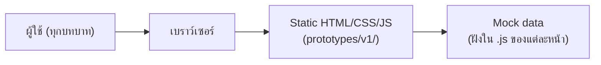
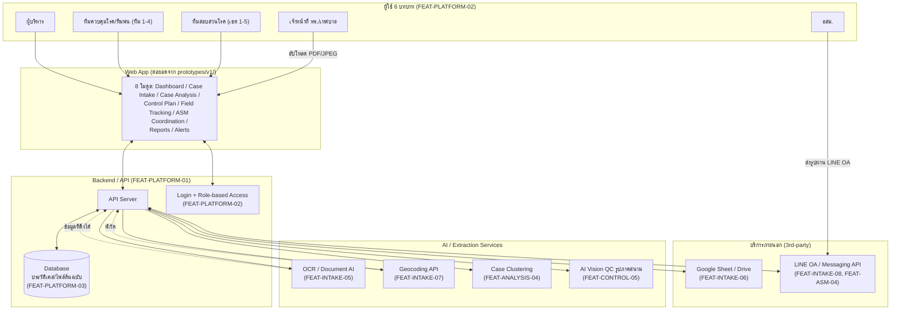
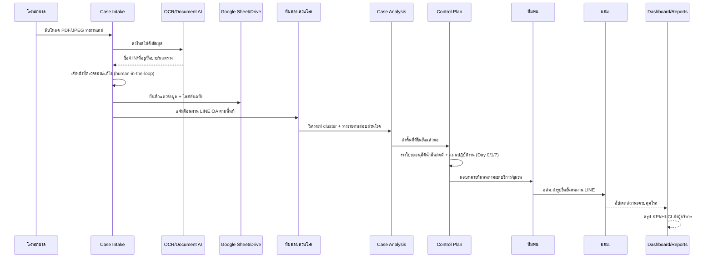
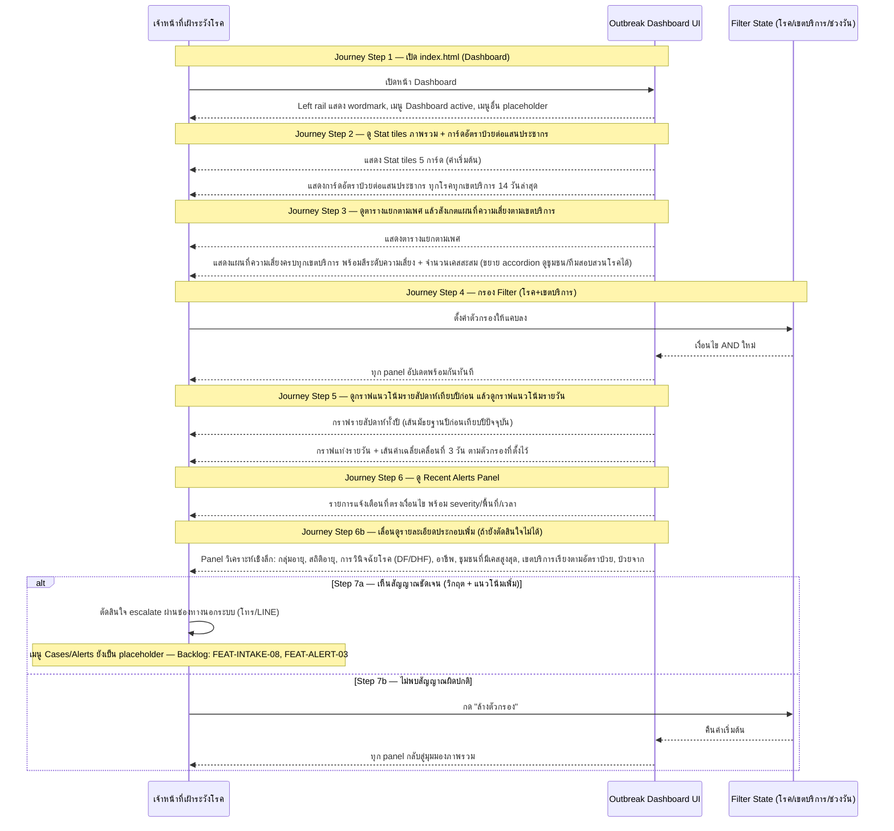

# High Level Architecture — AI-DSRP

อ้างอิงจาก [[../../../ROADMAP.md|ROADMAP.md]] (เฟสการเชื่อมต่อจริง) และ [[../../01-requirements/01-spec/FEATURE-LIST|FEATURE-LIST.md]] (ฟีเจอร์ต่อโมดูล) — เอกสารนี้อธิบาย 2 สถานะ: **สถานะปัจจุบัน** (prototype) และ **สถานะเป้าหมาย** (หลังเชื่อมต่อจริงตาม Phase 1-8)

## 1. สถานะปัจจุบัน (Prototype)

8 หน้า (`index.html`, `case-intake.html`, `case-analysis.html`, `control-plan.html`, `field-tracking.html`, `asm-coordination.html`, `reports.html`, `alerts.html`) เป็นไฟล์อิสระต่อกัน แต่ละหน้ามี mock data ของตัวเอง **ไม่มี backend, ไม่มี database, ไม่มี authentication จริง** — ทุก interaction (ยืนยัน, ส่งอนุมัติ, แจ้งเตือน) เป็น client-side state ที่หายไปเมื่อ reload หน้า

## 2. สถานะเป้าหมาย (หลัง Phase 1-8 ตาม ROADMAP.md)

### คำอธิบายแต่ละส่วน

| Layer | องค์ประกอบ | เชื่อมโยง Feature/Phase |
|---|---|---|
| **Users** | 6 บทบาทตาม role-based access | FEAT-PLATFORM-02 (Phase 7) |
| **Frontend** | Web app ต่อยอดจาก 8 หน้า prototype ปัจจุบัน | FEAT-DASH, FEAT-INTAKE, FEAT-ANALYSIS, FEAT-CONTROL, FEAT-TRACK, FEAT-ASM, FEAT-REPORT, FEAT-ALERT |
| **Backend/API** | API Server กลาง + Auth + Database | FEAT-PLATFORM-01/02/03 (Phase 7) |
| **AI Services** | OCR/Document AI, Geocoding, Case Clustering, Vision QC | FEAT-INTAKE-05/07, FEAT-ANALYSIS-04, FEAT-CONTROL-05 (Phase 1-3) |
| **External** | Google Sheet/Drive (เก็บข้อมูล+ไฟล์ต้นฉบับ), LINE OA (แจ้งเตือน/รับรูป) | FEAT-INTAKE-06/08, FEAT-ASM-03/04 (Phase 1, 4) |

## 3. Data Flow หลัก (เคสไข้เลือดออก 1 เคส)

## 3B. Data Flow ตาม User Journey — Outbreak Dashboard

Diagram นี้แปลงมาจากขั้นตอนจริงใน [[../01-prototypes/USER-JOURNEY-outbreak-dashboard|USER-JOURNEY-outbreak-dashboard.md]] (persona: สมศักดิ์ สุขวัฒน์ เจ้าหน้าที่เฝ้าระวังโรค) แบบ 1:1 ต่อ step — ใช้คำศัพท์ปัจจุบันที่ตรงกับ `prototypes/v1/index.html` จริง (เช่น "เขตบริการ", "Stat tiles", "แผนที่ความเสี่ยงตามเขตบริการ") แทนคำเดิมในเอกสาร journey ("ภูมิภาค", "KPI Cards") ที่เขียนไว้ก่อนหน้าจะปรับโครงสร้าง 2 รอบหลังสุด

> อัปเดต 2026-08-23: sync ให้ตรงกับ journey เวอร์ชันล่าสุดที่เพิ่ม panel วิเคราะห์เชิงลึก FEAT-DASH-07 ถึง 15 และ Step 6b ใหม่

### Journey Step ↔ Diagram interaction ↔ Feature ID

| Journey Step | Interaction ใน Diagram | Feature ID |
|---|---|---|
| 1. เปิด index.html (Dashboard) | จนท->>Dash: เปิดหน้า Dashboard / Dash-->>จนท: left rail + เมนู | FEAT-DASH-01 |
| 2. ดู Stat tiles ภาพรวม + การ์ดอัตราป่วยต่อแสนประชากร | Dash-->>จนท: แสดง Stat tiles ค่าเริ่มต้น / Dash-->>จนท: การ์ดอัตราป่วยต่อแสนประชากร | FEAT-DASH-02, FEAT-DASH-07 |
| 3. ดูตารางแยกตามเพศ แล้วสังเกตแผนที่ความเสี่ยงตามเขตบริการ | Dash-->>จนท: ตารางแยกตามเพศ / Dash-->>จนท: แผนที่ความเสี่ยงครบทุกเขตบริการ + สีความเสี่ยง | FEAT-DASH-08, FEAT-DASH-03 |
| 4. กรอง Filter (โรค+เขตบริการ) | จนท->>Filter / Filter-->>Dash / Dash-->>จนท: panel อัปเดตพร้อมกัน | FEAT-DASH-06 |
| 5. ดูกราฟแนวโน้มรายสัปดาห์เทียบปีก่อน แล้วดูกราฟแนวโน้มรายวัน | Dash-->>จนท: กราฟรายสัปดาห์เทียบปีก่อน / Dash-->>จนท: กราฟรายวัน + ค่าเฉลี่ยเคลื่อนที่ 3 วัน | FEAT-DASH-04 |
| 6. ดู Recent Alerts Panel | Dash-->>จนท: รายการแจ้งเตือนตรงเงื่อนไข | FEAT-DASH-05 |
| 6b. เลื่อนดูรายละเอียดประกอบเพิ่ม (ถ้ายังตัดสินใจไม่ได้) | Dash-->>จนท: Panel วิเคราะห์เชิงลึก (กลุ่มอายุ/สถิติอายุ/DF-DHF/อาชีพ/ชุมชน Top 8/เขตบริการเรียงอัตราป่วย/ป่วยจาก) | FEAT-DASH-09 ถึง 15 |
| 7a. เห็นสัญญาณชัดเจน → escalate นอกระบบ | alt branch: จนท->>จนท ตัดสินใจ escalate | Backlog: FEAT-INTAKE-08, FEAT-ALERT-03 |
| 7b. ไม่พบสัญญาณผิดปกติ → ล้างตัวกรอง | else branch: จนท->>Filter / Filter-->>Dash / Dash-->>จนท | FEAT-DASH-06 |

## 4. ข้อจำกัดทางเทคนิคที่ต้องพิจารณาก่อนสร้างจริง

อ้างอิงจากคำเตือนที่มีอยู่แล้วใน ROADMAP.md:

- **LINE ไม่มี API ติดตามตำแหน่งต่อเนื่อง** (Phase 3) — "location sharing" ของ LINE เป็นครั้งเดียว ต้องใช้แอป LIFF แยกถ้าต้องการ real-time tracking ทีมพ่น
- **รูปที่ส่งผ่าน LINE มักถูกล้าง EXIF/geotag** (Phase 3-4) — ต้องเก็บพิกัด/เวลาแยกตอนถ่ายผ่านแอป (LIFF ขอสิทธิ์ตำแหน่ง) ไม่ใช่ดึงจาก metadata ไฟล์ที่ส่งมา
- **LINE Messaging API มี quota** (free tier จำกัดจำนวนข้อความ/เดือน) — ต้องเช็คก่อน scale การแจ้งเตือนอัตโนมัติ (Phase 4)
- **PDPA** — ข้อมูลสุขภาพที่ส่งผ่าน 3rd-party API (Google/LINE) ต้องทบทวนให้สอดคล้องกฎหมาย โดยเฉพาะ chatbot อสม. (Phase 2) และรูปภาคสนาม (Phase 3-4) — chatbot ต้องจำกัดสิทธิ์แค่นัดหมาย/แจ้งพื้นที่ ห้ามส่งข้อมูลเคสละเอียด
- **Case clustering ต้องมี human-in-the-loop เสมอ** (Phase 2) — AI เสนอ cluster ที่เป็นไปได้เท่านั้น นักระบาดวิทยายืนยันก่อนทุกครั้ง เพราะ cluster ผิดอาจทำให้ทุ่มทรัพยากรผิดพื้นที่

## 5. ลำดับการสร้างจริง (อ้างอิง Phase ใน ROADMAP.md)

Phase 7 (Platform Foundations: Backend/API, Auth, Database) ควรทำคู่ขนานหรือก่อน Phase 1-4 เพราะทุกโมดูลพึ่งพา แต่ Phase 5 (รายงานสรุปอัตโนมัติ) ต้องทำ**หลังสุด**เพราะขึ้นกับคุณภาพข้อมูลจาก Phase 1-4 ทั้งหมด (ระบุไว้ชัดเจนใน ROADMAP.md แล้ว) — Phase 8 (Hardening: performance/security/accessibility) ทำเป็นลำดับสุดท้ายก่อนใช้งานจริง

## 6. Component Breakdown

ขยายรายละเอียดจากหัวข้อ 2 (สถานะเป้าหมาย) ระดับ component/service ทั้งระบบ — ระดับ capability/conceptual เท่านั้น ไม่ผูกกับ tech stack/ยี่ห้อเจาะจง ยกเว้น Google Sheet/Drive และ LINE OA ที่ ROADMAP.md ระบุชื่อจริงไว้แล้ว

| Component | หน้าที่ | เชื่อมกับ | Feature ID |
|---|---|---|---|
| Web App (Frontend) — 8 โมดูล (Dashboard / Case Intake / Case Analysis / Control Plan / Field Tracking / ASM Coordination / Reports / Alerts) | ส่วนติดต่อผู้ใช้ทั้ง 6 บทบาท ต่อยอดจาก 8 หน้า prototype ปัจจุบัน (เทคโนโลยีที่ยืนยัน: Vanilla JS + Node.js/EJS (หรือ Handlebars) partials — ดู TECH-STACK.md) | Auth/Role-based Access, API Server | FEAT-DASH, FEAT-INTAKE, FEAT-ANALYSIS, FEAT-CONTROL, FEAT-TRACK, FEAT-ASM, FEAT-REPORT, FEAT-ALERT |
| API Server | จุดกลางรับ-ส่ง/ประมวลผลข้อมูลระหว่าง Web App กับ Database, บริการ AI/Extraction, และบริการภายนอกทั้งหมด (เทคโนโลยีที่ยืนยัน: Node.js + Express (หรือ Fastify) — ดู TECH-STACK.md) | Web App, Auth, Database, บริการ OCR/Geocoding/Case Clustering/Vision QC/Chatbot, Google Sheet/Drive, LINE OA | FEAT-PLATFORM-01 |
| Auth / Role-based Access | ตรวจสอบตัวตนและจำกัดสิทธิ์การเข้าถึงข้อมูล/ฟังก์ชันตาม 6 บทบาท (เทคโนโลยีที่ยืนยัน: Firebase Authentication, Email/Password — ดู TECH-STACK.md) — ปัจจุบัน implement แค่ authentication (ยืนยันตัวตน) ยังไม่มี role-based authorization จริงระดับ Security Rules/UI (ทุกผู้ใช้ที่ login เห็นทุกหน้าเหมือนกัน) | Web App, API Server | FEAT-PLATFORM-02 |
| Database | จัดเก็บประวัติเคสและไฟล์ต้นฉบับระยะยาว (มาแทน Google Sheet/Drive เมื่อ Phase 7 เสร็จ ดู Decision Log ข้อ 1) (เทคโนโลยีที่ยืนยัน: Firebase Firestore — ดู TECH-STACK.md) | API Server | FEAT-PLATFORM-03 |
| บริการดึงข้อมูลจากภาพเอกสาร (OCR/Document AI) | แปลงไฟล์ PDF/JPEG รายงานเคสเป็นข้อมูล (ชื่อ/HN/ที่อยู่/วันป่วย/ผลตรวจ) ให้เจ้าหน้าที่ตรวจสอบ/แก้ไขก่อนยืนยัน (human-in-the-loop) (เทคโนโลยีที่ยืนยัน: Claude Vision (Anthropic) — ดู TECH-STACK.md) | API Server (โมดูล Case Intake) | FEAT-INTAKE-05 |
| บริการ Geocoding | แปลงที่อยู่เป็นพิกัดจริง พร้อม fallback ให้ปักหมุดด้วยมือเมื่อความแม่นยำต่ำ (เทคโนโลยีที่ยืนยัน: Google Maps Geocoding API — ดู TECH-STACK.md) | API Server (โมดูล Case Intake) | FEAT-INTAKE-07 |
| บริการ Case Clustering (statistical/spatial-temporal) | วิเคราะห์เชื่อมโยงเคสตามเวลา/พื้นที่/ความสัมพันธ์ผู้สัมผัส เสนอ "cluster ที่เป็นไปได้" ให้นักระบาดวิทยายืนยันก่อนทุกครั้ง (human-in-the-loop) (เทคโนโลยีที่ยืนยัน: BigQuery GIS — ดู TECH-STACK.md) | API Server (โมดูล Case Analysis) | FEAT-ANALYSIS-04 |
| บริการ AI Vision QC ตรวจรูปภาคสนาม | ตรวจรูปถ่ายจากทีมพ่น/อสม. ว่าตรงกับพื้นที่/เวลาที่ต้องพ่นจริงไหม แทนคนไล่ดูทีละรูป (เทคโนโลยีที่ยืนยัน: Claude Vision (Anthropic) ผ่าน OpenRouter API — ดู TECH-STACK.md) | API Server (โมดูล Field Tracking / ASM Coordination) | FEAT-CONTROL-05 |
| Chatbot ประสานงาน อสม. (จำกัดสิทธิ์แค่นัดหมาย/แจ้งพื้นที่) | สนทนากับ อสม. เพื่อนัดหมาย/แจ้งพื้นที่เบื้องต้นเท่านั้น ห้ามส่งข้อมูลเคสละเอียด (ความเสี่ยง PDPA) มี fallback ให้โทรจริงสำหรับเคสเร่งด่วน | API Server (โมดูล Case Analysis), LINE OA | FEAT-ANALYSIS-06 |
| Google Sheet / Drive | เก็บข้อมูลที่ยืนยันแล้ว (แถวข้อมูล) คู่กับไฟล์ต้นฉบับ (PDF/JPEG) ใน Drive — ใช้ก่อนมี Database จริงใน Phase 7 (ดู Decision Log ข้อ 1) | API Server | FEAT-INTAKE-06 |
| LINE OA / Messaging API | ช่องทางแจ้งเตือนทีมสอบสวนโรคตามพื้นที่ + แจ้งเตือน อสม. ล่วงหน้า (scheduled message วันที่ 0/7) + รับรูปภาคสนามจาก อสม./ทีมพ่น | API Server, ผู้ใช้ (ทีมสอบสวนโรค, อสม., ทีมพ่น) | FEAT-INTAKE-08, FEAT-ASM-04 |
| บริการติดตามตำแหน่งทีมพ่น (แอปแยก/LIFF) | ขอสิทธิ์ตำแหน่งต่อเนื่องจากทีมพ่น เทียบกับ spot map ที่วางแผนไว้ — ต้องเป็นแอปแยกจาก LINE native chat เพราะ LINE ไม่มี API ติดตามตำแหน่งต่อเนื่อง (ดู Decision Log ข้อ 5) (เทคโนโลยีที่ยืนยัน: LINE LIFF (LINE Front-end Framework) mini-app — ดู TECH-STACK.md) | API Server, Web App (โมดูล Field Tracking) | FEAT-CONTROL-04 |
| บริการรวมข้อมูลสรุปผู้บริหาร (Reporting aggregation) | รวมข้อมูลจากทุกทีม (จำนวนเคส, สถานะควบคุมโรค, รูปถ่ายยืนยัน, HI/CI, รายงานสอบสวน) เป็นรายงานประจำวัน/รายสัปดาห์อัตโนมัติ (เทคโนโลยีที่ยืนยัน: หน้าสรุปรายงานในแอป (Node.js/EJS) ดึงจาก Firestore โดยตรง + export PDF ส่งผ่าน LINE OA — ดู TECH-STACK.md) | API Server, Database, Web App (โมดูล Reports) | FEAT-REPORT-03 |
| การเชื่อมข้อมูล real-time ระหว่าง Alert Management กับ Dashboard | sync สถานะแจ้งเตือน/การมอบหมายงานจากโมดูล Alerts เข้าสู่ Outbreak Dashboard แทน mock data คนละชุด | API Server, Web App (โมดูล Alerts, Dashboard) | FEAT-ALERT-03 |
| Hosting/Infrastructure | โครงสร้างพื้นฐานที่ให้บริการ Web App และ API Server (เทคโนโลยีที่ยืนยัน: Firebase Hosting หรือ Cloud Run + Cloud Functions — ดู TECH-STACK.md) | Web App, API Server | FEAT-PLATFORM-01 |
| Monitoring/Logging | ติดตาม error/uptime ของระบบ (Backend/API, Cloud Functions) (เทคโนโลยีที่ยืนยัน: Cloud Logging + Cloud Monitoring (GCP native) — ดู TECH-STACK.md) | API Server, Hosting/Infrastructure | FEAT-PLATFORM-01 |

## 7. Decision Log

> บันทึกย้อนหลังจาก decision ที่ปรากฏใน ROADMAP.md อยู่แล้ว (วันที่ 2026-08-26 ในทุกรายการหมายถึงวันที่บันทึกเป็นทางการในเอกสารนี้ ไม่ใช่วันที่ตัดสินใจจริงซึ่งเกิดขึ้นตอนวางแผน ROADMAP.md)

| วันที่ | บริบท (Context) | ตัวเลือกที่พิจารณา | ทางที่เลือก | ผลกระทบ |
|---|---|---|---|---|
| 2026-08-26 | ต้องมีที่เก็บข้อมูลเคส/ไฟล์ต้นฉบับใน Phase 1 แต่ Database จริง (FEAT-PLATFORM-03) อยู่ใน Phase 7 | (1) รอสร้าง Database ก่อนแล้วเชื่อม Phase 1 ทีเดียว (2) ใช้ Google Sheet/Drive ไปก่อนแล้วย้ายข้อมูลเข้า Database ทีหลัง (3) ใช้ local file storage ชั่วคราว | เลือก (2) ใช้ Google Sheet/Drive (FEAT-INTAKE-06) เพราะทีมงานคุ้นเคยอยู่แล้วและเริ่มใช้งานจริงได้เร็วกว่ารอ Phase 7 | ได้เริ่มใช้งานจริงเร็วขึ้น แต่ต้องมีแผนย้ายข้อมูลเข้า Database ตอน Phase 7 และต้องดูแล schema ของ Sheet ให้สอดคล้องกับ Database ที่จะสร้างในอนาคต |
| 2026-08-26 | ต้องเลือกช่องทางแจ้งเตือน/ประสานงานหลักกับทีมสอบสวนโรค/อสม./ทีมพ่น | (1) สร้างแอปมือถือเฉพาะของระบบ (2) ใช้ LINE OA / Messaging API ที่มีอยู่แล้ว (3) ใช้ SMS/อีเมล | เลือก (2) LINE OA (FEAT-INTAKE-08, FEAT-ASM-04) เพราะทีมสอบสวนโรค/อสม. ใช้ LINE อยู่แล้วในชีวิตประจำวัน ลด adoption cost | ลด adoption cost ได้มาก แต่ต้องแลกกับข้อจำกัดด้าน location tracking ต่อเนื่องไม่ได้ (ดูข้อ 5) และ EXIF ของรูปที่ส่งผ่าน LINE ถูกล้าง (ดูข้อ 6) รวมถึง quota ของ LINE Messaging API free tier |
| 2026-08-26 | OCR extraction, Case Clustering, และการปิด Alert เป็นจุดที่ AI ประมวลผลแต่ผลลัพธ์ผิดมีความเสี่ยงสูง | (1) ให้ AI ทำงานอัตโนมัติเต็มรูปแบบ (full-automation) เพื่อความเร็ว (2) บังคับ human-in-the-loop ให้คนยืนยันก่อนทุกครั้ง (3) สุ่มตรวจบางเปอร์เซ็นต์ (partial review) | เลือก (2) บังคับ human-in-the-loop สำหรับ OCR extraction (FEAT-INTAKE-05), Case Clustering (FEAT-ANALYSIS-04), และการปิด Alert (FEAT-ALERT-02) | ความเสี่ยงจากข้อมูลผิด/cluster ผิด/ปิดเคสผิดพลาดต่ำลงมาก แต่แลกกับความเร็วที่ลดลงเทียบกับ full-automation ต้องมีคนตรวจทานทุกครั้งก่อนข้อมูลเข้าสู่ระบบจริง |
| 2026-08-26 | ทุกโมดูล (FEAT-DASH ถึง FEAT-ALERT) พึ่งพา Backend/API, Auth, Database ที่อยู่ใน Phase 7 ตามลำดับเลข Phase | (1) ทำตามลำดับเลข Phase (Phase 1-6 ก่อน Phase 7) (2) ทำ Phase 7 คู่ขนานหรือก่อน Phase 1-4 (3) ทำ Phase 7 แบบ incremental ทีละส่วนตามที่ Phase อื่นต้องใช้ | เลือก (2) ทำ Phase 7 (Platform Foundations: Backend/API FEAT-PLATFORM-01, Auth FEAT-PLATFORM-02, Database FEAT-PLATFORM-03) คู่ขนานหรือก่อน Phase 1-4 เพราะทุกโมดูลพึ่งพา | ลำดับการพัฒนาจริงต้องวางแผนข้าม Phase มากกว่าจะไล่ตามเลข Phase ตรงๆ ทีมพัฒนาต้องเข้าใจ dependency นี้ตั้งแต่ต้น ไม่ใช่แค่ทำตามลำดับเอกสาร |
| 2026-08-26 | ต้อง real-time tracking ตำแหน่งทีมพ่นเทียบกับ spot map ที่วางแผนไว้ (Phase 3) | (1) ใช้ LINE native location sharing (2) สร้างแอป LIFF แยกที่ขอสิทธิ์ตำแหน่งต่อเนื่อง (3) ใช้อุปกรณ์ GPS tracker แยกต่างหาก | เลือก (2) แอป LIFF แยก (FEAT-CONTROL-04) เพราะ LINE location sharing เป็นการแชร์ครั้งเดียว ไม่มี API ติดตามตำแหน่งต่อเนื่อง | ต้องพัฒนา/ดูแลแอปแยกเพิ่มเติมนอกเหนือจาก LINE OA และต้องพิจารณาความสมัครใจ/กฎหมายแรงงานเรื่องการติดตามตำแหน่งพนักงานภาคสนามด้วย |
| 2026-08-26 | ต้องตรวจสอบด้วย AI Vision QC ว่ารูปถ่ายภาคสนามตรงกับพื้นที่/เวลาที่ต้องพ่นจริงไหม (Phase 3-4) | (1) อ่าน EXIF/geotag จากไฟล์รูปที่ส่งผ่าน LINE โดยตรง (2) เก็บพิกัด/เวลาถ่ายภาพจากแอปตอนถ่าย (ผ่าน LIFF ขอสิทธิ์ตำแหน่ง) (3) ให้ผู้ใช้กรอกพิกัด/เวลาด้วยมือ | เลือก (2) เก็บพิกัด/เวลาจากแอปตอนถ่ายภาพ (FEAT-CONTROL-05, เกี่ยวเนื่องกับ FEAT-ASM-03) เพราะ LINE ล้าง EXIF/geotag ออกจากรูปที่ส่งผ่านแชทเป็นปกติ | ต้องพึ่งพาแอป LIFF เดียวกับที่ใช้ tracking ตำแหน่งทีมพ่น (ข้อ 5) เพิ่ม dependency ระหว่าง feature แต่ได้พิกัด/เวลาที่แม่นยำกว่าการอ่าน metadata ที่ถูกล้างไปแล้ว |
